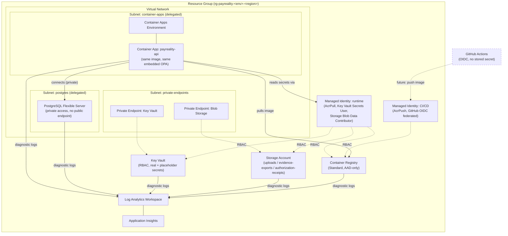

# Architecture Diagram

**Status:** final, Milestone 2. Reflects exactly what `AZURE_MIGRATION/terraform/` provisions — nothing aspirational, nothing from a later milestone drawn in early.

## Reading this diagram

- **Solid arrows** are wired and functional the moment Milestone 3 applies this configuration.
- **Dashed elements** (GitHub Actions) represent the CI/CD *identity trust relationship* this milestone establishes (the federated credential) — the workflow that actually uses it is not created until a later milestone, per Milestone 2's own CI/CD Preparation boundary.
- Nothing in this diagram shows DNS or the public internet reaching this Container App — that's deliberate. Ingress exists (`*.azurecontainerapps.io`, HTTPS-only) but no custom domain is bound and no production traffic reaches it until Milestone 9.
