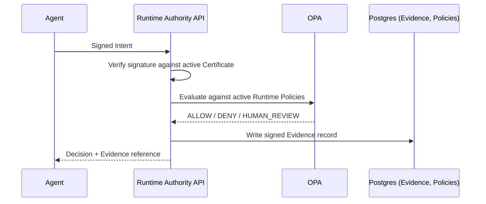
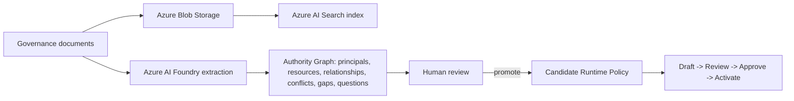

# Sales Enablement Pack

Every claim below follows `ENTERPRISE_MESSAGING_GUIDE.md`'s definitions and guardrails exactly; nothing here should ever drift from that document without updating both. Labels: VERIFIED (checked directly against the shipped platform), INFERRED (a reasonable conclusion from verified facts), PROPOSED (a sales framing choice, not a fact).

---

## 1. Executive Overview

**For**: a prospect's VP/C-level sponsor, five minutes, no technical background assumed.

AI agents are starting to take real, consequential actions inside enterprises: approving payments, placing orders, granting access. Every one of those actions used to pass through a human who implicitly checked "am I actually allowed to do this." An autonomous agent has no equivalent check unless one is built for it.

Runtime Authority is that check. Before an agent acts, it verifies the agent's delegated authority against the organization's own real governance rules, deterministically, and produces a cryptographically signed record of the decision, independently verifiable by the organization's own team, not just PayReality's dashboard.

It is not a monitoring tool that reviews what already happened. It is not a generic AI safety layer. It is a specific, provable authorization decision, made before execution, every time.

**What this means for the business**: a defensible answer, backed by a real signed record, to "who authorized this AI-driven transaction, and under what rule," the exact question an auditor, a regulator, or a board asks after any AI-driven incident, asked here before the fact rather than reconstructed after one.

---

## 2. One-pager

**PayReality Runtime Authority**: pre-execution authorization for AI agents.

| | |
|---|---|
| **The problem** | AI agents can now take real business actions with no independent authorization check before they act |
| **The mechanism** | Every action is submitted as a signed Intent, evaluated against deterministic Runtime Policies (real OPA, real Rego, never a language model's judgment at decision time), and returns ALLOW, DENY, or HUMAN_REVIEW |
| **The evidence** | Every decision produces a signed, hash-chained, independently verifiable record |
| **The authority model** | Extracted from the organization's own real governance documents (Authority Intelligence), always human-reviewed before anything is enforced |
| **The infrastructure** | Multi-tenant, Azure-hosted (Container Apps, Postgres, Key Vault, AI Foundry, AI Search), identity-first security throughout |
| **The integration path** | Direct API or Python SDK; the SDK generates and holds the agent's signing key client-side |
| **Where it stands today** | Live in Azure production (`api.aisecurewatch.com`), multi-tenant isolation tested with a real second organization, no completed pilot or reference customer yet |

---

## 3. Technical Overview

**For**: a prospect's engineering evaluator.

**Request flow**: Agent (holds an Ed25519 keypair, generated client-side, private key never transmitted) signs an Intent (JSON, canonically serialized) and submits it. The API verifies the signature against the agent's active Certificate, resolves the acting Principal and its position in the Authority Graph, evaluates every active Runtime Policy for the organization via a real embedded OPA instance, and returns a Decision. A signed Evidence record is produced regardless of outcome.

**Policy lifecycle**: draft, submitted for review, approved, activated (compiles to Rego, deploys a real bundle to OPA with a recorded hash), later deprecated, archived, or rolled back to a prior version. A Runtime Policy Simulator (fixed and re-verified in Milestone 6) lets a reviewer test a candidate policy against a hypothetical Intent before it ever goes live, including saved Test Scenarios and CSV-driven Batch Simulation against historical data.

**Authority Intelligence**: document upload (a corpus of one or more governance documents) triggers a real Azure AI Foundry extraction, producing principals, resources, operations, relationships, conflicts, gaps, and questions, each cited to a specific source excerpt and location, each carrying the model's own stated confidence and reasoning. Extracted Runtime Policy candidates are promoted individually, by a human, through the same review/approve/activate lifecycle every other policy uses; nothing skips that gate.

**Multi-tenancy**: organization-scoped at the data layer across Postgres (row-level `organization_id` on every relevant table), OPA (per-organization compiled packages, never a shared package across organizations), Azure Blob Storage (per-organization path prefixes), and Azure AI Search (a filterable `organization_id` field on every indexed document). Verified live with a real second organization created specifically to test isolation (Milestone 5), which saw zero data belonging to the first.

**SDK**: Python today (`pip install`-able), handles keypair generation, request signing, and the full Agent lifecycle (register, activate, submit Intent, resolve HUMAN_REVIEW outcomes).

---

## 4. Security Overview

See `SPECIFICATION/14_SECURITY_MODEL.md` for the complete internal reference this section is drawn from; nothing here should say anything that document doesn't already support.

- **Authentication**: layered (agent-signature verification for Intent submission, session/API-key plus RBAC for human users, a platform-admin-only operator credential for cross-organization operations).
- **Cryptography**: Ed25519 for every signature (agent certificates, Evidence), SHA-256 for hashing and API-key storage, bcrypt specifically for human passwords, each choice made for the specific property it needs, not a single undifferentiated "we encrypt things" claim.
- **RBAC**: six fixed roles, permission-based (never a raw role check anywhere in the codebase, by explicit design), an addressable, auditable model.
- **Isolation**: organization-scoped at every layer named in the Technical Overview above, tested with a real second organization, not assumed from code review alone.
- **Evidence integrity**: signed, hash-chained, independently verifiable; a signing-key rotation registry means historical Evidence stays verifiable after a key rotation.
- **What is not yet built, disclosed here as plainly as internally**: account lockout after repeated failed logins, distributed (multi-instance) rate limiting, and enforced MFA (the schema exists; the login-time challenge does not). SOC 2 has not been started.

---

## 5. Architecture Deck (outline, with embedded diagrams)

**Slide 1: The request flow**

**Slide 2: Authority Intelligence flow**

**Slide 3: Multi-tenant isolation**, one Azure environment, N organizations, each with its own row-scoped Postgres data, its own compiled OPA package, its own Blob path prefix, its own AI Search filter; no shared state between organizations at any layer.

**Slide 4: Azure production topology**, Container Apps (API), Postgres Flexible Server (private network only), Key Vault (RBAC-only secrets), Managed Identity (no static credentials for Azure-to-Azure calls), AI Foundry + AI Search (Authority Intelligence), Blob Storage (documents), fronted by a real custom domain and Azure-managed certificate as of Milestone 7.

**Slide 5: Evidence chain**, every decision's Evidence record hash-chains to the one before it within an organization; tampering with or deleting a record breaks the chain in a way that's independently detectable, not just contractually prohibited.

---

## 6. Pilot Deck (outline)

Follows `PILOT_PROGRAM_GUIDE.md` exactly: Qualification -> Discovery -> Deployment -> Integration -> Validation -> Success Metrics -> Expansion -> Reference Customer. Present as a single-slide-per-stage narrative; do not compress Discovery and Deployment into one slide, since the real-document-collection step in Discovery is the single highest-leverage moment in the entire pilot and deserves to be seen as its own stage, not folded into "setup."

---

## 7. Enterprise FAQ

**"Is this a monitoring or logging product?"** No. It makes the authorization decision before the action happens; a monitoring tool only ever sees the action after the fact.

**"Does an AI model decide our authorization rules?"** No. Runtime Policies are deterministic and evaluated by OPA, not by a language model at decision time. AI (Azure AI Foundry) only ever proposes candidate policies from your own documents, and every candidate requires an explicit human promotion and approval before it can be enforced.

**"What happens if your signing key is compromised?"** Historical Evidence signed under a prior key stays verifiable via the signing-key registry; a compromise triggers rotation, not a loss of past verifiability.

**"Can we run this on-premises?"** Not today. The platform is a multi-tenant, Azure-hosted service.

**"Are you SOC 2 certified?"** Not yet; see the Launch Readiness assessment for the honest current status and plan.

**"Do you have a reference customer?"** Not yet; see the Pilot Program Guide's Reference Customer section for the plan once one exists.

**"What language does the SDK support?"** Python today.

**"What happens to our data if we deactivate our organization?"** Nothing is deleted; deactivation is a reversible status change, not a data-destruction action.

---

## 8. Deployment Guide (sales-facing summary; full technical version lives in the Enterprise Documentation Plan's Administrator/Developer Guides)

A pilot organization is provisioned in the shared, multi-tenant Azure production environment (no separate infrastructure stood up per customer); onboarding is an organization-creation and owner-invitation flow, not an infrastructure project. Typical pilot Deployment (per the Pilot Program Guide) completes in the order: organization created, owner claimed, first document corpus uploaded, first policy activated, first agent registered and activated, each a real, working, previously-verified platform capability, not a new build.
