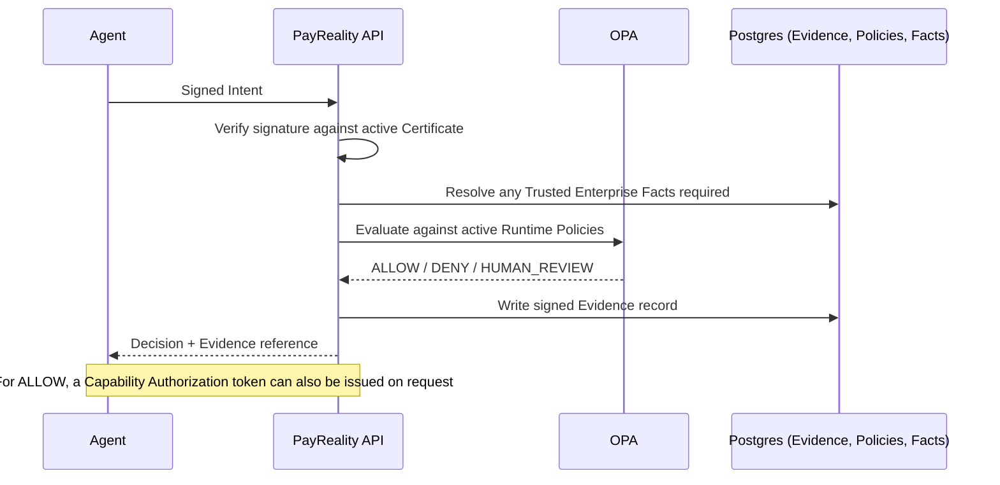
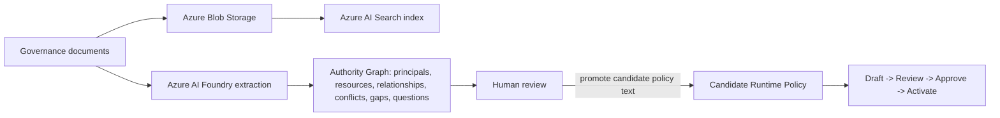

# Sales Enablement Pack

Every claim below follows `ENTERPRISE_MESSAGING_GUIDE.md`'s definitions, boundaries, and guardrails exactly; nothing here should ever drift from that document without updating both. Labels: VERIFIED (checked directly against the shipped platform), REFERENCE ONLY (a real, working artifact built to prove a mechanism, not a production integration), INFERRED (a reasonable conclusion from verified facts), PROPOSED (a sales framing choice, not a fact).

**Status: aligned as of Milestone 17.1 (POC Readiness Remediation), 2026-08-25**, to the rewritten messaging guide. The prior version of this pack predated Trusted Enterprise Facts, Authority Freshness, and Capability Authorization, and stated the platform's boundary less precisely than the current messaging guide requires. This version corrects both.

---

## 1. Executive Overview

**For**: a prospect's VP or C level sponsor, five minutes, no technical background assumed.

AI agents are starting to take real, consequential actions inside enterprises: approving payments, placing orders, granting access. Every one of those actions used to pass through a human who implicitly checked "am I actually allowed to do this." An autonomous agent has no equivalent check unless one is built for it.

PayReality is the Enterprise AI Authority Infrastructure. Before an agent acts, PayReality evaluates the agent's proposed action against the organization's own real governance rules, deterministically, and produces a cryptographically signed record of the decision, independently verifiable by the organization's own team, not just PayReality's dashboard. For an approved action, PayReality can also issue a signed, single use authorization credential that a downstream system can require before it acts.

It is not a monitoring tool that reviews what already happened. It is not a generic AI safety layer. It is a specific, provable authorization decision, made before execution, every time.

**Said plainly, because a sophisticated buyer will ask**: PayReality decides and proves; it does not, on its own, physically stop a system that chooses to ignore its answer. That happens only where a real enforcement point is built to require PayReality's decision, and today that is a capability the platform enables rather than a thing it has fully deployed for any customer. Section 4 states this precisely, because it is the single most important fact for a security minded buyer to hear directly from us rather than discover later.

**What this means for the business**: a defensible answer, backed by a real signed record, to "who authorized this AI driven transaction, and under what rule," the exact question an auditor, a regulator, or a board asks after any AI driven incident, asked here before the fact rather than reconstructed after one.

---

## 2. One pager

**PayReality: the Enterprise AI Authority Infrastructure.**

| | |
|---|---|
| **The problem** | AI agents can now take real business actions with no independent authorization check before they act |
| **The mechanism** | Every action is submitted as a signed Intent, evaluated against deterministic Runtime Policies (real OPA, real Rego, never a language model's judgment at decision time), and returns ALLOW, DENY, or HUMAN_REVIEW |
| **The evidence** | Every decision produces a signed, hash chained, independently verifiable record |
| **The authority model** | Extracted from the organization's own real governance documents (Authority Intelligence), always human reviewed before anything is enforced |
| **Trusted facts** | Policies can reference facts from registered, signed sources, with mandatory expiry and fail closed handling of anything missing, expired, or contradictory |
| **Authority freshness** | Policies carry attestation and review cadence; expired high or critical risk authority forces human review, kept distinct from a routine review reminder |
| **Capability authorization** | For an approved action, PayReality can issue a signed, single use authorization token bound to that exact decision; a downstream enforcement point can require it before acting, though this is not itself enforcement |
| **The infrastructure** | Multi tenant, Azure hosted (Container Apps, Postgres, Key Vault, AI Foundry, AI Search), identity first security throughout |
| **The integration path** | Direct API or Python SDK; the SDK generates and holds the agent's signing key client side |
| **The current boundary** | PayReality is a Policy Decision Point today, not a Policy Enforcement Point; no production enforcement point exists yet for any customer, and a real one is what a first proof of concept would help define |
| **Where it stands today** | Live in Azure production (`api.aisecurewatch.com`), multi tenant isolation tested with a real second organization, no completed pilot or reference customer yet |

---

## 3. Technical Overview

**For**: a prospect's engineering evaluator.

**Request flow**: Agent (holds an Ed25519 keypair, generated client side, private key never transmitted) signs an Intent (JSON, canonically serialized) and submits it. The API verifies the signature against the agent's active Certificate, resolves the acting Principal and its position in the Authority Graph and Authority Model, resolves any Trusted Enterprise Facts a matched policy's conditions reference, evaluates every active Runtime Policy for the organization via a real embedded OPA instance, and returns a Decision. A signed Evidence record is produced regardless of outcome, in the same database transaction as the decision itself. For an ALLOW outcome, a Capability Authorization token can additionally be issued on request.

**Policy lifecycle**: draft, submitted for review, approved, activated (compiles to Rego, deploys a real bundle to OPA with a recorded hash), later deprecated, archived, or rolled back to a new draft based on a prior version (rollback never reactivates history directly, by deliberate design). A Runtime Policy Simulator lets a reviewer test a candidate policy against a hypothetical Intent before it ever goes live, including saved Test Scenarios and CSV driven Batch Simulation against historical data. Runtime Policies today are flat, single stage rules; there is no multi step or sequential approval primitive in the current model.

**Authority Intelligence**: document upload (a corpus of one or more governance documents) triggers a real Azure AI Foundry extraction, producing principals, resources, operations, relationships, conflicts, gaps, and questions, each cited to a specific source excerpt and location, each carrying the model's own stated confidence and reasoning. Only AI proposed policy candidates, generated directly from the source text, have a real path into a draft Runtime Policy, through the same human gated review, approve, and activate lifecycle every other policy uses; nothing skips that gate. The rest of the Authority Graph (principals, relationships, conflicts) either has no code path into enforcement, or, once resolved and activated, enriches the context a policy's own conditions can reference, but never generates a condition on its own.

**Trusted Enterprise Facts**: a registered fact source, with its own Ed25519 keypair and active or revoked lifecycle, signs an attestation binding organization, subject, key, value, and an expiry. A policy condition can reference a fact by a namespaced key, resolved before OPA evaluation. A fact is usable only if its source is active and belongs to the organization, its signature verifies, it has not expired, and it does not conflict with another currently trusted fact for the same subject and key; any of those failing resolves to unknown, which the existing fail closed decision path already handles. The exact fact values relied upon are recorded on the decision's own Evidence. There is no real external connector today; the reference `supplier_approved` scenario in this codebase proves the mechanism, not a live integration with any named enterprise system.

**Authority Freshness**: a Runtime Policy carries `last_attested_at`, `next_review_at`, `review_cadence_days`, and `authority_expires_at`. Re attestation updates the review fields without touching the policy's active status. A dashboard surfaces policies due for re attestation as its own distinct signal from a policy's own scheduled expirations. Separately, for a matched policy with a high or critical risk level whose `authority_expires_at` has genuinely passed, the decision is downgraded to HUMAN_REVIEW with an explicit reason; the same check does not currently force a review for a low or medium risk policy, a disclosed and deliberate trade off.

**Capability Authorization**: for an eligible ALLOW decision, a short lived, signed capability token can be issued, reusing the platform's existing Ed25519 signing key registry. The token binds, under signature, the decision id, principal, action, resource, the exact constraints evaluated, the policy version, the fact hashes relied upon, an audience naming a specific enforcement adapter, an expiry, and a nonce, and can be verified and consumed exactly once. This is a transport and proof mechanism, not an enforcement location on its own; it only produces real bypass resistance once paired with a genuine enforcement point that actually refuses to act without a valid token, and no such production enforcement point exists today. The one enforcement adapter in this codebase (`scripts/reference_enforcement_adapter.py`) is a reference implementation that proves the token mechanism rejects replay, tampering, expiry, and parameter mismatch; it is explicitly not a SAP integration and not itself an enterprise Policy Enforcement Point.

**Multi tenancy**: organization scoped at the data layer across Postgres (row level `organization_id` on every relevant table, including the newer fact, capability, and freshness tables), OPA (per organization compiled packages, never a shared package across organizations), Azure Blob Storage (per organization path prefixes), and Azure AI Search (a filterable `organization_id` field on every indexed document). Verified live with a real second organization created specifically to test isolation, which saw zero data belonging to the first.

**SDK**: Python today (`pip install` able), handles keypair generation, request signing, and the full Agent lifecycle (register, activate, submit Intent, resolve HUMAN_REVIEW outcomes).

---

## 4. Current boundary: decision versus enforcement

This section exists because it is the fact a sophisticated technical or security evaluator will ask about directly, and because overstating it is the single fastest way to lose credibility with exactly that evaluator.

**What is true today**: PayReality is a Policy Decision Point. It evaluates a proposed action and determines whether it is authorized. It produces signed evidence of that determination. For an approved action, it can issue a cryptographically bound Capability Authorization token, scoped to the exact decision, action, resource, and amount.

**What is not true today**: PayReality does not itself intercept, block, or prevent an action. Nothing in the platform detects or stops a calling system that receives a DENY or a HUMAN_REVIEW and proceeds anyway, or a system that never calls PayReality at all. The reference enforcement adapter in this codebase proves that a call routed through it correctly rejects an invalid, expired, tampered, or mismatched capability token; it does not prove, and does not claim to prove, that a real target system cannot be reached through some other path.

**What a real proof of concept should establish**: which specific downstream system, on which specific action, would actually require a valid PayReality decision or capability token before proceeding, and how that requirement is enforced technically (an API gateway, a sidecar, an orchestration step, or a direct integration in the target system itself). That is a real, scoped, and solvable integration question, not a gap in what PayReality decides or proves.

State this proactively rather than waiting for the objection. It reads as more credible, not less, precisely because almost everything upstream of this boundary is independently verifiable.

---

## 5. Security Overview

See `SPECIFICATION/14_SECURITY_MODEL.md` for the complete internal reference this section is drawn from; nothing here should say anything that document doesn't already support.

- **Authentication**: layered (agent signature verification for Intent submission, session or API key plus RBAC for human users, a platform admin only operator credential for cross organization operations).
- **Cryptography**: Ed25519 for every signature (agent certificates, Evidence, Capability Authorization tokens, fact source attestations), SHA-256 for hashing and API key storage, bcrypt specifically for human passwords, each choice made for the specific property it needs, not a single undifferentiated "we encrypt things" claim.
- **RBAC**: permission based roles (never a raw role check anywhere in the codebase, by explicit design), including two deliberately narrow permissions added for facts and capability issuance, both granted only to a governance admin role.
- **Isolation**: organization scoped at every layer named in the Technical Overview above, tested with a real second organization, not assumed from code review alone.
- **Evidence integrity**: signed, hash chained, independently verifiable; a signing key rotation registry means historical Evidence stays verifiable after a key rotation, and the same registry is reused unmodified for capability tokens.
- **Replay protection**: the same proven mechanism, a database level unique constraint on source and nonce, independently applied to Intent submission, fact attestation, and capability token consumption.
- **Fail closed behavior**: every unresolved or ambiguous branch resolves to HUMAN_REVIEW, never a default ALLOW; this now explicitly includes missing, expired, or conflicting facts, and expired high or critical risk authority, not only the original decision engine branches.
- **What is not yet built, disclosed here as plainly as internally**: account lockout after repeated failed logins, distributed (multi instance) rate limiting, and enforced MFA (the schema exists; the login time challenge does not). SOC 2 has not been started. No production Policy Enforcement Point exists (see Section 4).

---

## 6. Architecture Deck (outline, with embedded diagrams)

**Slide 1: The request flow**

**Slide 2: Authority Intelligence flow**

**Slide 3: Multi tenant isolation**, one Azure environment, N organizations, each with its own row scoped Postgres data (including facts and capability tokens), its own compiled OPA package, its own Blob path prefix, its own AI Search filter; no shared state between organizations at any layer.

**Slide 4: Azure production topology**, Container Apps (API), Postgres Flexible Server (private network only), Key Vault (RBAC only secrets), Managed Identity (no static credentials for Azure to Azure calls), AI Foundry and AI Search (Authority Intelligence), Blob Storage (documents), fronted by a real custom domain and Azure managed certificate.

**Slide 5: Evidence chain and capability binding**, every decision's Evidence record hash chains to the one before it within an organization; tampering with or deleting a record breaks the chain in a way that's independently detectable. A Capability Authorization token, where issued, is bound under the same signature discipline to the exact decision, action, resource, and constraints, and can be consumed exactly once.

**Slide 6: Where enforcement lives today**, PayReality decides and proves; a downstream enforcement point (not yet deployed for any customer) is what would actually require a valid decision or capability token before a target system acts. Shown as a distinct, honestly labeled stage, not folded into the decision flow.

---

## 7. Pilot Deck (outline)

Follows `PILOT_PROGRAM_GUIDE.md` exactly: Qualification, Discovery, Deployment, Integration, Validation, Success Metrics, Expansion, Reference Customer. Present as a single slide per stage narrative; do not compress Discovery and Deployment into one slide, since the real document collection step in Discovery is the single highest leverage moment in the entire pilot and deserves to be seen as its own stage, not folded into "setup." Where a pilot's scenario would benefit from Trusted Enterprise Facts or Capability Authorization, name the specific fact or the specific downstream system explicitly during Discovery, since both require a real, scoped connector or integration decision rather than a generic platform capability switched on.

---

## 8. Enterprise FAQ

**"Is this a monitoring or logging product?"** No. It makes the authorization decision before the action happens; a monitoring tool only ever sees the action after the fact.

**"Does an AI model decide our authorization rules?"** No. Runtime Policies are deterministic and evaluated by OPA, not by a language model at decision time. AI (Azure AI Foundry) only ever proposes candidate policies and candidate authority data from your own documents, and every candidate policy requires an explicit human promotion and approval before it can be enforced.

**"Does PayReality actually stop an unauthorized action from happening?"** PayReality decides and proves, before execution. It does not, on its own, physically block a system that ignores its answer. That requires a real enforcement point, built on the specific path your action takes, to require a valid PayReality decision or Capability Authorization token before acting. No such production enforcement point exists yet for any customer; identifying and building the right one for your specific integration is exactly what a proof of concept is for.

**"What is a Capability Authorization token, and is that enforcement?"** It is a signed, single use credential PayReality can issue for an approved action, bound to the exact decision, action, resource, and amount. It is not itself enforcement; it becomes meaningful only once a downstream system is built to require it before acting.

**"Can PayReality verify facts like whether a supplier is approved, or whether budget is available?"** PayReality can evaluate a policy condition against a fact from a registered, signed source, with mandatory expiry and fail closed handling if the fact is missing, expired, or contradictory. It proves what that source asserted, not independent, objective truth, and there is no live connector to any named enterprise system today; a real fact source would need to be identified and connected for your specific scenario.

**"What happens if your signing key is compromised?"** Historical Evidence signed under a prior key stays verifiable via the signing key registry; a compromise triggers rotation, not a loss of past verifiability.

**"Can we run this on premises?"** Not today. The platform is a multi tenant, Azure hosted service.

**"Are you SOC 2 certified?"** Not yet; see the Launch Readiness assessment for the honest current status and plan.

**"Do you have a reference customer?"** Not yet; see the Pilot Program Guide's Reference Customer section for the plan once one exists.

**"What language does the SDK support?"** Python today.

**"What happens to our data if we deactivate our organization?"** Nothing is deleted; deactivation is a reversible status change, not a data destruction action.

---

## 9. Deployment Guide (sales facing summary; full technical version lives in the Enterprise Documentation Plan's Administrator and Developer Guides)

A pilot organization is provisioned in the shared, multi tenant Azure production environment (no separate infrastructure stood up per customer); onboarding is an organization creation and owner invitation flow, not an infrastructure project. Typical pilot Deployment (per the Pilot Program Guide) completes in the order: organization created, owner claimed, first document corpus uploaded, first policy activated, first agent registered and activated, each a real, working, previously verified platform capability, not a new build. Where a pilot's scenario needs a trusted fact source or a downstream enforcement point, that is scoped and built as part of Discovery and Integration for that specific pilot, not assumed to already exist.

---

## 10. What changed in this alignment pass, and why

This section exists to give an internal reader a fast summary of how this pack now differs from the version it replaces; it is safe to keep in the sales facing document since it contains no claim of its own, only pointers to Sections above.

- **Category corrected**: every section now leads with "the Enterprise AI Authority Infrastructure" rather than the narrower "pre execution authorization for AI agents" framing alone, matching the messaging guide's locked category.
- **Three supporting capabilities added**: Trusted Enterprise Facts, Authority Freshness, and Capability Authorization are now described in the One pager, Technical Overview, Security Overview, Architecture Deck, and FAQ, since all three are real and shipped, and their absence understated the current platform.
- **Enforcement boundary made explicit**: a new Section 4, a new FAQ answer, and a new Architecture Deck slide state plainly that PayReality is a Policy Decision Point without a production Policy Enforcement Point, and that the reference enforcement adapter is proof of mechanism only. This replaces language that previously implied, without stating outright, that the platform's authorization check could not be bypassed.
- **No new customers, pilots, partnerships, integrations, or performance numbers were added.** Everything added in this pass is either a real, shipped capability verified against the current codebase and `POC_READINESS_REPORT.md`, or an explicit statement of a current limit. Where the pack previously implied more enforcement certainty than is real, that language was tightened, not supplemented with a new unverified claim.
