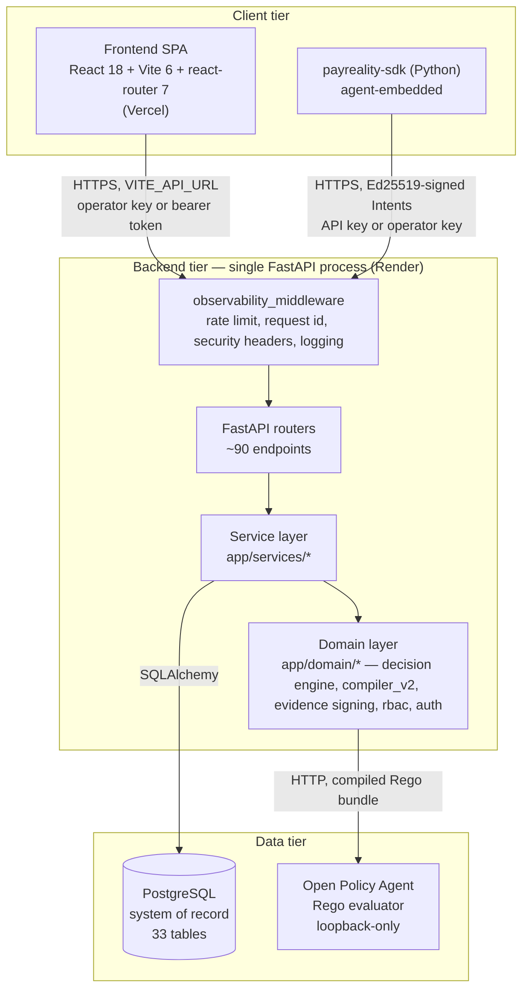
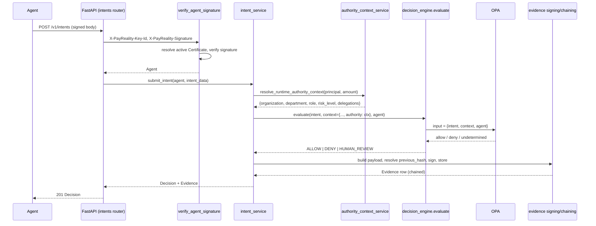
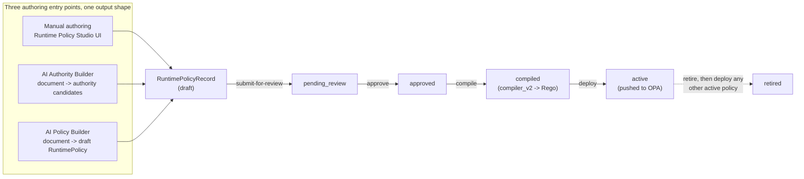
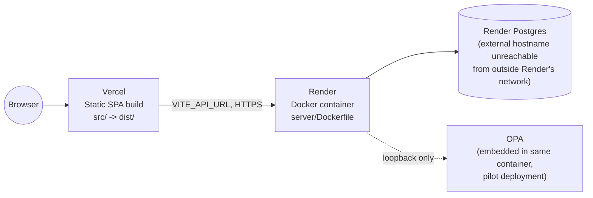

# Part 2 — Complete System Architecture

**Supersedes/synthesizes:** `ARCHITECTURE.md`, `DEPLOYMENT.md`, `DOMAIN_ABSTRACTION.md`. `ARCHITECTURE.md` still describes the legacy Authority/Mandate pipeline as current and states "no human RBAC," "no key rotation," "no evidence chaining" as open gaps — all three are now shipped; this part reflects the actual current architecture.

## 2.1 System topology

The backend is a single FastAPI process. It is the only thing that talks to Postgres or OPA — the frontend and SDK never do so directly. OPA has no authentication of its own; it must never be reachable from outside the backend's private network. In the current pilot deployment it runs embedded in the same container, bound to loopback only, unreachable from any other service.

## 2.2 The four architectural layers, backend

| Layer | Location | Responsibility | Depends on |
|---|---|---|---|
| **Routers** | `server/app/routers/*.py` | HTTP surface: parse request, call one service function, shape the response. No business logic. | Services, schemas, dependencies |
| **Services** | `server/app/services/*.py` | Orchestration: transactions, multi-step workflows, calling domain logic and persisting results. | Domain, DB models |
| **Domain** | `server/app/domain/**` | Pure or near-pure business logic: the decision engine, the Rego compiler, evidence signing/canonicalization, RBAC permission tables, request-signature verification. Minimal I/O. | Almost nothing else |
| **DB models / schemas** | `server/app/db/models.py`, `server/app/schemas/*.py` | SQLAlchemy ORM models (persistence shape) and Pydantic schemas (wire shape) — deliberately two different shapes for the same concept, never conflated. | — |

This is a conventional layered architecture, not a framework's opinion imposed on the codebase — there is no dependency-injection container, no repository-pattern abstraction over SQLAlchemy, no CQRS split. See [04_BACKEND.md](04_BACKEND.md) for the full module map and [20_ARCHITECTURAL_ASSESSMENT.md](20_ARCHITECTURAL_ASSESSMENT.md) for whether that's the right level of abstraction at this scale (it is).

## 2.3 The core pipeline (the reason every other subsystem exists)

Every other subsystem in this platform (frontend, authoring pipelines, RBAC, agent lifecycle) exists to feed into or read out of this one sequence. See [12_DECISION_ENGINE.md](12_DECISION_ENGINE.md) for the evaluation semantics and [13_EVIDENCE_ENGINE.md](13_EVIDENCE_ENGINE.md) for signing/chaining detail.

## 2.4 The policy authoring pipeline (feeds the OPA bundle the sequence above queries)

All three authoring surfaces converge on the same `RuntimePolicyRecord` model and the same `compiler_v2` compiler — there is exactly one thing that ever writes to OPA today (see [17_LEGACY_COMPONENTS.md](17_LEGACY_COMPONENTS.md) for the now-fully-retired competing pipeline this replaced). See [07_RUNTIME_POLICY_ENGINE.md](07_RUNTIME_POLICY_ENGINE.md), [09_AI_AUTHORITY_BUILDER.md](09_AI_AUTHORITY_BUILDER.md), [10_AI_POLICY_BUILDER.md](10_AI_POLICY_BUILDER.md).

## 2.5 Request lifecycle (every HTTP request, uniformly)

Every request passes through exactly one middleware, `app/security.py::observability_middleware`:

1. Per-client-IP fixed-window rate limit (429 if exceeded; 120 requests / 60s, in-process memory — see [16_CURRENT_LIMITATIONS.md](16_CURRENT_LIMITATIONS.md) for the multi-instance caveat).
2. Assigns/propagates `X-Request-ID`.
3. Calls the route handler inside one `try/except`, converting any unhandled exception to a clean `{"detail": "internal_error"}` 500 (the real exception is logged server-side with the same request id, never leaked to the caller).
4. Adds security headers (`X-Content-Type-Options`, `X-Frame-Options`, `Referrer-Policy`, `Permissions-Policy`, `Strict-Transport-Security` in production).
5. Logs one structured access line per request.

This is deliberately **one** middleware, not several stacked `app.middleware("http")` layers — Starlette's `BaseHTTPMiddleware` has a documented history of losing an inner exception across stacked instances, so a single try/except around `call_next` is the reliable version of the same behavior (verified during this platform's own development).

## 2.6 Auth architecture, at a glance

Full detail in [14_SECURITY_MODEL.md](14_SECURITY_MODEL.md). Four mechanisms coexist today, layered so nothing already integrated ever breaks:

| Mechanism | Where | Used for |
|---|---|---|
| **Agent signature** (Ed25519) | `domain/auth/signature.py`, `dependencies.py::verify_agent_signature` | Every `POST /v1/intents` — the only path that ever asserts "this specific agent said this." |
| **Operator key** (`X-PayReality-Operator-Key`) | `security.py::verify_operator_key`, `dependencies.py::require_permission` | A single shared credential that is always a full bypass for `require_permission` — every pre-RBAC integration (SDK, existing automation) keeps working unmodified there. `get_current_organization`'s Operator Key branch is different, and changed in Milestone 2 (Multi-Tenant Foundation): it is now platform-admin-only and must be given an explicit target organisation (`X-PayReality-Organization-Id`) on every org-scoped request — there is no longer a default. |
| **Bearer token → Role → Permission** (RBAC) | `dependencies.py::require_permission`, `domain/rbac/permissions.py` | Real per-user authorization for every mutating endpoint, when no operator key is present. "Never check roles directly, always check permissions." |
| **Session cookie/token → User** | `dependencies.py::get_current_user` | Routes that need to know exactly *which human* is acting (login/me/logout, Users management) — distinct from `require_permission`, which only needs a permission, not an identity. |
| **`get_current_organization`, no separate permission** | Most read-only GETs (Evidence, Authority Graph, Runtime Policies, Runtime Policy Lifecycle dashboard/search/timeline) | **Corrected, Milestone 1 and 2.** This row previously claimed no cross-tenant boundary existed for reads to violate; that was checked directly and found false (see [14_SECURITY_MODEL.md](14_SECURITY_MODEL.md) §14.6). Every one of these now resolves the caller's organisation and scopes its query to it — a genuinely different organisation's row is treated identically to one that doesn't exist, not merely unreachable because only one organisation happened to exist. |

## 2.7 Deployment topology

- **Frontend:** Vercel, static build (`npm run build` → `dist/`).
- **Backend:** Render, containerized via `server/Dockerfile`, defined declaratively in `render.yaml` (a Render Blueprint).
- **Database:** Render-managed Postgres. Its `DATABASE_URL` resolves to an internal-only hostname reachable from within Render's network; operating on it from outside (e.g. this specification's own verification work) requires the external connection string, not the internal one.
- **OPA:** embedded in the backend container today (loopback-only bind), reused across the zero-cost pilot; the documented target once billing exists is OPA as its own private network service. This is a cost-driven interim choice, not an architectural one — nothing about the Decision Engine's client code changes when OPA moves to its own service, since it already talks to OPA over HTTP.

See [22_BUILD_FROM_SCRATCH.md](22_BUILD_FROM_SCRATCH.md) for the reasoning behind each of these choices if rebuilding from zero.

## 2.8 What's domain-specific versus domain-agnostic

`DOMAIN_ABSTRACTION.md` and `DOMAIN_AGNOSTIC_ARCHITECTURE.md` (both still accurate as design intent, not superseded) describe a target where PayReality's engine — Decision Engine, Evidence, Agent lifecycle, RBAC — is domain-agnostic infrastructure, with "financial services" as one adapter (a `FinancialVocabulary` of known scopes/currencies/conditions) rather than a hardcoded assumption. As built today:

- **Domain-agnostic already:** the Decision Engine, Evidence signing/chaining, Agent lifecycle, RBAC, and the Runtime Policy schema itself (a `RuntimePolicyRecord` has no financial-specific columns).
- **Financial-specific today:** `compiler_v2`'s `FinancialVocabulary` (amount, currency, vendor-category conditions) and the AI extraction prompts (tuned for delegation-of-authority / payment-approval documents). `DOMAIN_REFACTOR_PLAN.md` itemizes the sequenced work to generalize these; none of it has been executed, per that document and confirmed by the current `compiler_v2` code, which still imports `FinancialVocabulary` directly rather than through a pluggable adapter interface.

## 2.9 Why this shape, in one paragraph

Every architectural choice above optimizes for one property: **an enforcement decision must be reproducible and its record must be independently verifiable, without asking anyone to trust this server.** That is why the Decision Engine is OPA/Rego rather than an LLM call (§1.6), why Evidence is signed with a published public key rather than just stored (§13), why the RBAC model checks permissions rather than role identity (§14), and why the database is the single source of truth Assurance reads from rather than a separately maintained metric. Every subsequent part of this specification is a deeper look at one piece of this same shape.
