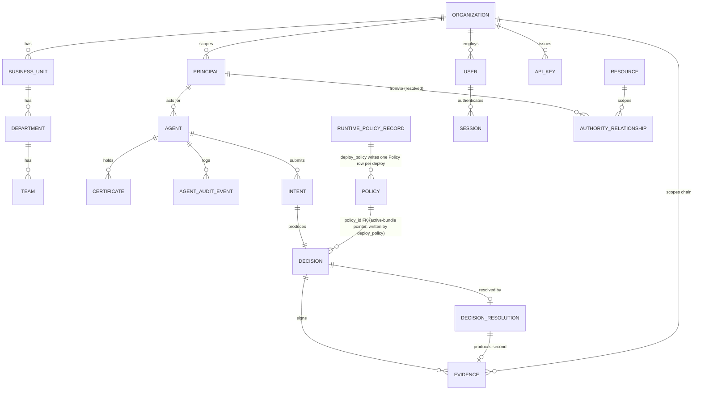

# Part 5 — Database

**Supersedes/synthesizes:** `ARCHITECTURE.md` (data-model section, which describes only the original 6-table core and is missing the 27 tables added since). Full inventory below is read directly from `server/app/db/models.py` (33 tables) and `server/alembic/versions/` (14 migrations), not from any prior document.

## 5.1 All 33 tables

Grouped by subsystem, matching the rest of this specification's parts:

**Runtime Authority Model (Phase 1) — [08_RUNTIME_AUTHORITY.md](08_RUNTIME_AUTHORITY.md)**

| Table | Key columns | Notes |
|---|---|---|
| `business_units` | `organization_id`, `name` | Org-hierarchy level 1 |
| `departments` | `business_unit_id`, `name` | Level 2 |
| `teams` | `department_id`, `name` | Level 3 — most Principals attach here |
| `resources` | `name`, `type`, `owner_principal_id`, `organization_id` | Promotes the informational Authority Builder concept into an enforcement-referenceable table |

**Core identity**

| Table | Key columns | Notes |
|---|---|---|
| `principals` | `name`, `organization_id`, `business_unit_id`, `department_id`, `team_id`, `role`, `source_document_id` | The person/entity an Agent acts *for* |
| `organizations` | `name`, `timezone`, `default_currency`, `default_language`, `settings (JSONB)` | Single row today (single-tenant); `settings` holds Organisation Settings' free-form config |
| `agents` | `name`, `acting_for_principal_id`, `status`, `owner`, `environment`, `tags`, `last_seen_at`, `rotation_requested_at` | Full lifecycle identity, see [11_AGENT_ARCHITECTURE.md](11_AGENT_ARCHITECTURE.md) |
| `certificates` | `agent_id`, `public_key`, `status` (`issued/active/rotated/expired/revoked`) | Partial unique index: at most one `active` per agent |
| `agent_audit_events` | `agent_id`, `event_type`, `actor`, `payload (JSONB)`, `key_id`, `signature` | Signed lifecycle audit ledger, same signing primitives as Evidence |

**Auth / RBAC (Phase 10) — [14_SECURITY_MODEL.md](14_SECURITY_MODEL.md)**

| Table | Key columns | Notes |
|---|---|---|
| `users` | `organization_id`, `email`, `password_hash`, `role`, `mfa_enabled`, `must_reset_password` | One of 6 fixed roles (CHECK constraint) |
| `sessions` | `user_id`, `expires_at`, `revoked_at` | Session id **is** the bearer token — validating a session is one PK lookup, revoking is one row update/delete, no JWT |
| `api_keys` | `organization_id`, `key_hash` (SHA-256), `key_prefix`, `role`, `created_by_user_id` | Fast digest, not bcrypt — deliberate, see table's own docstring: a generated high-entropy secret doesn't need a slow salted hash |
| `signing_keys` | `key_id` (PK), `public_key_b64`, `retired_at` | Registry enabling verification across a key rotation — see [13_EVIDENCE_ENGINE.md](13_EVIDENCE_ENGINE.md) |

**Runtime Policy Engine (Compiler V2) — [07_RUNTIME_POLICY_ENGINE.md](07_RUNTIME_POLICY_ENGINE.md)**

| Table | Key columns | Notes |
|---|---|---|
| `runtime_policy_records` | `policy_key`, `version`, `status`, `content (JSONB)`, `bundle_id`, `bundle_hash` | One immutable row per version; editing = new row, never an update |

**Decision pipeline — [12_DECISION_ENGINE.md](12_DECISION_ENGINE.md), [13_EVIDENCE_ENGINE.md](13_EVIDENCE_ENGINE.md)**

| Table | Key columns | Notes |
|---|---|---|
| `intents` | `agent_id`, `action`, `amount`, `currency`, `counterparty`, `context (JSONB)`, `nonce`, `requested_at` | `UNIQUE(agent_id, nonce)` — replay protection |
| `decisions` | `intent_id`, `policy_id`, `outcome` (`ALLOW/DENY/HUMAN_REVIEW`), `reason`, `evaluated_mandates (JSONB)` | Immutable after creation |
| `evidence` | `decision_id`, `payload (JSONB)`, `key_id`, `signature`, `status`, `organization_id` | `organization_id` is the Phase 5 chain-scope key; `idx_evidence_organization_created` supports "find the prior record in this scope" fast |
| `decision_resolutions` | `decision_id` (unique), `resolution` (`approved/denied`), `resolved_by`, `evidence_id` | Closes a `HUMAN_REVIEW` loop without mutating `decisions` |

**AI Policy Builder — [10_AI_POLICY_BUILDER.md](10_AI_POLICY_BUILDER.md)**

| Table | Key columns | Notes |
|---|---|---|
| `policy_extraction_uploads` | `filename`, `format`, `content (bytes)`, `status`, `error` | Single-document upload |
| `policy_extraction_candidates` | `upload_id` / `corpus_id` (exactly one, CHECK-enforced), `content (JSONB)`, `confidence`, `missing_fields`, `promoted_policy_key` | Shared by both AI builders — see below |

**AI Authority Builder — [09_AI_AUTHORITY_BUILDER.md](09_AI_AUTHORITY_BUILDER.md)**

| Table | Key columns | Notes |
|---|---|---|
| `authority_corpora` | `name`, `status`, `error` | One multi-document analysis session |
| `authority_corpus_documents` | `corpus_id`, `filename`, `format`, `content (bytes)` | One uploaded file within a corpus |
| `authority_principals` | `corpus_id`, `name`, `role`, `reports_to`, `confidence` | Discovered authority holder — informational |
| `authority_resources` | `corpus_id`, `name`, `description`, `confidence` | Discovered business object |
| `authority_operations` | `corpus_id`, `name`, `description`, `confidence` | Discovered verb/action |
| `authority_relationships` | `corpus_id`, `kind` (`delegation/escalation/inheritance`), `from_principal`/`to_principal` (text) **+** `from_principal_id`/`to_principal_id`/`resource_id` (real FKs, Phase 1), `operation`, `valid_from`/`valid_to`, `status`, `cross_org_approved` | Extraction provenance (text names) preserved alongside the resolved, enforceable graph edge (FKs) |
| `authority_conflicts` | `corpus_id`, `description`, `reasoning`, `confidence` | Model-reported contradiction, always human-reviewed |
| `authority_gaps` | `corpus_id`, `description`, `confidence` | Missing information the model expected and didn't find |
| `authority_questions` | `corpus_id`, `question`, `answered`, `answer` | Clarification request for a human reviewer |

**Legacy Authority/Mandate pipeline — retired, tables kept empty — [17_LEGACY_COMPONENTS.md](17_LEGACY_COMPONENTS.md)**

| Table | Notes |
|---|---|
| `documents` | Byte-identical original upload, legacy extraction. **Empty in production.** |
| `authorities` | Extracted authority claims, legacy model. **Empty in production.** |
| `mandates` | Per-principal/scope limits compiled from approved Authorities. **Empty in production.** |
| `constraints` | Per-mandate typed constraints. **Empty in production.** |

**`policies` is the one exception, and it is not dead — read this carefully.** It still has a partial unique index enforcing at most one `status='active'` row **per organization** (`idx_policies_single_active_per_org`, widened from a platform-wide `idx_policies_single_active` by Milestone 2's Multi-Tenant Foundation — mathematically equivalent for any deployment with exactly one Organisation), and it is still exactly what `decision_engine.py`'s `_DbPolicyStore.get_active()` reads on every single Intent evaluation (now filtered by the acting Principal's own `organization_id`, bound at `intent_service.submit_intent`'s call site — see §7.12 below). What changed is *who writes to it*: the legacy authoring pipeline that used to write it (`policy_service.activate_policy`) is retired and 410's; today the **only** writer is Compiler V2's `runtime_policy_service.deploy_policy`, which inserts a new `Policy` row (`bundle_uri="runtime_policy_studio:{policy_key}:{version}"`, `organization_id` set) and retires the prior one **for the same organization** on every deploy — specifically so the Decision Engine's unmodified `PolicyStore` protocol keeps working without being touched. Confirmed directly against production before Milestone 2's migration: `policies` had 5 rows (4 `retired`, 1 `active`, all with real `bundle_hash` values and a `runtime_policy_studio:` `bundle_uri` prefix, `organization_id` backfilled to the platform's one bootstrapped Organisation), not zero. See [07_RUNTIME_POLICY_ENGINE.md](07_RUNTIME_POLICY_ENGINE.md) §7.11/§7.12 and [12_DECISION_ENGINE.md](12_DECISION_ENGINE.md) §12.3 for the full mechanics — this is one of the least obvious integration points in the whole system, and the one place the "retired legacy table" mental model would mislead a reader.

Zero non-empty rows in `documents`/`authorities`/`mandates`/`constraints`; `policies` remains live infrastructure under a new sole writer (see [17_LEGACY_COMPONENTS.md](17_LEGACY_COMPONENTS.md) for the full retirement record and this nuance).

## 5.2 Entity-relationship diagram (active pipeline only)

## 5.3 Migration history (chronological, 14 total)

| # | Revision | Name | What it did |
|---|---|---|---|
| 1 | `d1f41ef42ccd` | Initial schema | `principals`, `documents`, `authorities`, `policies`, `mandates`, `constraints`, `agents`, `certificates`, `intents`, `decisions`, `evidence`, `decision_resolutions` |
| 2 | `334dcaaa2a87` | `reviewer_id` as free text, not UUID FK | No users table existed yet |
| 3 | `489c66c83eb4` | Use `TIMESTAMPTZ` for all datetime columns | Fixed a real server-timezone bug (§5.4) |
| 4 | `1e7d5877eab7` | Add `status` column to `evidence` | `VERIFIED`/`PENDING`/`REJECTED` |
| 5 | `7c2f9a1b3e4d` | Store document content in DB | Container-local disk doesn't survive a redeploy and is root-owned |
| 6 | `9a4e6c1f2b7d` | Add `runtime_policy_records` | Compiler V2 / Policy Studio persistence |
| 7 | `3e7a1c9f8b2d` | Add AI Policy Builder tables | `policy_extraction_uploads`, `policy_extraction_candidates` |
| 8 | `5b8f2d4a9c1e` | Add AI Authority Builder tables | `authority_corpora` + 7 related tables |
| 9 | `6c3d8f1a4e29` | Add Agent Lifecycle Management | Phase 9: new `agents`/`certificates` statuses, `agent_audit_events` |
| 10 | `8f4d2e6a1c3b` | Add signing keys registry | `signing_keys` |
| 11 | `2d5a7c9e1f43` | Add RBAC and Organisation tables | Phase 10: `organizations`, `users`, `sessions`, `api_keys` |
| 12 | `805e62a44ac1` | Drop unused `intents.requested_scope`/`metadata` | Dead columns, confirmed zero non-default rows in production before dropping |
| 13 | `b58b031aeb21` | Phase 1 Authority Model schema | `business_units`/`departments`/`teams`/`resources`, `principals`/`authority_relationships` extensions |
| 14 | `411edb414123` | Phase 5 Evidence chaining organisation scope | `evidence.organization_id` + index |

## 5.4 Cross-cutting schema conventions

- **Every `datetime` is `TIMESTAMPTZ`**, forced via `Base.type_annotation_map = {datetime: DateTime(timezone=True)}`. This traces to a real bug: the local Postgres install's server timezone defaulted to UTC+2, so without this override, a timezone-aware Python datetime silently converted to server-local wall-clock time on write and lost its offset on read — which broke Mandate `valid_from`/`valid_to` comparisons against Intent timestamps inside the compiled Rego (both looked like naive ISO strings representing different instants). Migration 3 retrofitted this onto every pre-existing column.
- **UUID primary keys everywhere** (`uuid_pk()` helper), never auto-incrementing integers — avoids leaking row-count/creation-order information and matches every FK reference being a UUID.
- **JSONB is used only for genuinely variable-shape data** (`Intent.context`, `Authority`/`Mandate.conditions`, `Evidence.payload`, `RuntimePolicyRecord.content`, `Organization.settings`), never as a substitute for a real column anywhere the shape was knowable ahead of time.
- **`CheckConstraint` enforces every fixed vocabulary at the database level**, not only in application code — every `status`/`role`/`kind`/`outcome`/`resolution` column has one. This is deliberate defense-in-depth: application code being correct today doesn't protect against a future direct-SQL fix or a bug that bypasses the ORM layer.
- **Partial unique indexes enforce "at most one active X"** where that invariant matters: `idx_policies_single_active` (one active legacy Policy), `idx_certificates_single_active` (one active Certificate per Agent). This is a database-level guarantee, not just an application-level check-then-write, which matters because concurrent requests can otherwise race past an application-level check.
- **Free-text over FK, deliberately, in a few places**: `authority_relationships.from_principal`/`to_principal` (text) intentionally coexist with `from_principal_id`/`to_principal_id` (real FKs) — the text columns are the AI-extraction provenance (what the source document literally said) and are never silently overwritten once a human resolves them to a real Principal.
- **No custom Alembic `naming_convention`** is configured anywhere in this codebase — unnamed constraints follow Postgres's own default `<table>_<column>_fkey` pattern. This matters operationally: Alembic's `--autogenerate` reliably emits `None` as the constraint name for unnamed FKs and misses `CheckConstraint`s entirely, so every autogenerated migration touching a FK or CHECK in this repository's history required manual correction with an explicit, convention-matching name before it was safe to run.

## 5.5 What's active vs. dormant, by table

| Status | Tables |
|---|---|
| **Active, core enforcement path** | `principals`, `agents`, `certificates`, `intents`, `decisions`, `evidence`, `decision_resolutions`, `runtime_policy_records`, `organizations` |
| **Active, RBAC/auth** | `users`, `sessions`, `api_keys`, `signing_keys` |
| **Active, Authority Model, schema-ready but not yet a policy pre-filter** | `business_units`, `departments`, `teams`, `resources`, `authority_relationships` (real-FK columns) |
| **Active, AI authoring pipelines** | `policy_extraction_uploads`, `policy_extraction_candidates`, `authority_corpora`, `authority_corpus_documents`, `authority_principals`, `authority_resources`, `authority_operations`, `authority_conflicts`, `authority_gaps`, `authority_questions` |
| **Active, audit** | `agent_audit_events` |
| **Active — repurposed as the Decision Engine's active-bundle pointer, sole writer is `deploy_policy`** | `policies` |
| **Dead — kept as empty tables** | `documents`, `authorities`, `mandates`, `constraints` (legacy pipeline, see [17_LEGACY_COMPONENTS.md](17_LEGACY_COMPONENTS.md)) |
