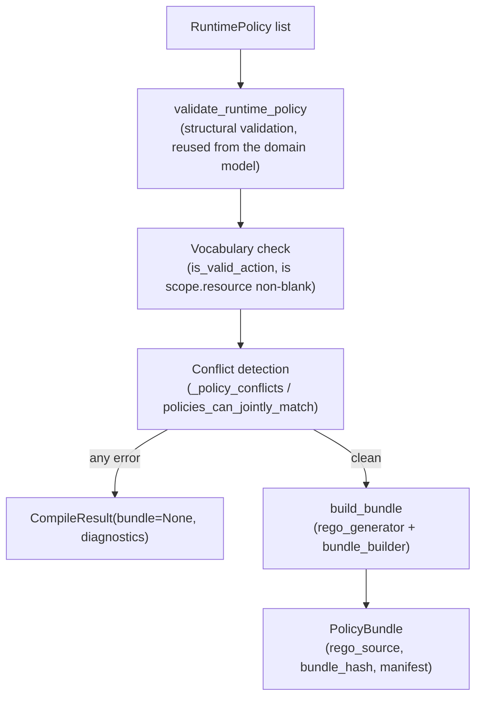

# Part 7 — Runtime Policy Engine (Compiler V2)

**Supersedes/synthesizes:** `COMPILER_V2_ARCHITECTURE.md`, `POLICY_COMPILER_V2.md`, `RUNTIME_POLICY_LANGUAGE.md`, `RUNTIME_POLICY_MAPPING.md`, `POLICY_LANGUAGE_SPEC.md`. `POLICY_COMPILER_V2.md`'s own "honest finding that today's compiler doesn't enforce most conditions at all" describes an earlier state of this system — as built and verified today, every condition compiles to real, evaluated Rego, not inert metadata.

## 7.1 What this subsystem is

The Runtime Policy Engine turns a `RuntimePolicy` — a plain, framework-agnostic value object (`domain/runtime_policy/runtime_policy.py`) — into a Rego bundle that Open Policy Agent can evaluate. It is the sole path to OPA today; the legacy Authority/Mandate compiler that used to compete with it has been fully retired (see [17_LEGACY_COMPONENTS.md](17_LEGACY_COMPONENTS.md)).

## 7.2 The `RuntimePolicy` shape

```python
RuntimePolicy(
    id: str, name: str, version: int, status: PolicyStatus,
    scope: Scope(principal, action, agent=None, resource=None),
    conditions: ConditionSet,   # a flat, AND-only list of Conditions
    effect: Effect,            # ALLOW | DENY | REQUIRE_HUMAN_REVIEW
    description: str | None,
    constraints: Constraints,
    metadata: Metadata,
    audit: AuditTrail | None,
)
```

A `RuntimePolicy` is immutable — editing one produces a new value with an incremented `version`, never a mutation. This mirrors `RuntimePolicyRecord`'s own persistence discipline (§5.1): a policy version is a fact about what was authored and approved at a point in time.

`Scope.agent` and `Scope.resource` are genuine extensions beyond the retired Authority/Mandate model, which only scoped by principal + action. `ConditionSet` is flat and AND-only by design — every condition in the list must hold; there is no OR, no nesting. Each `Condition` is `(field, operator, value)`, where `operator` is one of `LTE, GTE, EQ, NEQ, LT, GT, IN, CONTAINS, EXISTS`.

## 7.3 Compilation pipeline (`compile_bundle`, the one public entry point)



`compile_bundle` **never raises** for a normal compilation failure — it always returns a `CompileResult`, whose `.ok` is `False` and `.bundle` is `None` whenever `.diagnostics` has any error. This makes "why didn't my policy compile" a structured, displayable list (`CompilerDiagnostics`) rather than an exception the frontend has to parse out of a stack trace.

## 7.4 Vocabulary: the one deliberately domain-specific seam

`compile_bundle` validates `scope.action` against an injectable `Vocabulary` protocol (`is_valid_action(action) -> bool`), defaulting to `FINANCIAL_VOCABULARY` — today, `{"vendor_payment", "purchase_order_create", "wire_transfer"}`. This is the one place [02_SYSTEM_ARCHITECTURE.md](02_SYSTEM_ARCHITECTURE.md) §2.8's domain-agnostic/domain-specific boundary is concretely drawn in code: the compiler itself has no financial-specific logic, but its one shipped default vocabulary does. Adding a second domain means supplying a different `Vocabulary` implementation, not modifying the compiler.

## 7.5 Rego generation, field by field

`rego_generator.py`'s `generate_condition_expression` is the module that makes every condition real, evaluated Rego rather than inert metadata. Two generation rules matter most:

- **Every condition field defaults to `input.intent.<field>`.** A field prefixed `"context."` instead targets `input.context.<rest>` — because the real OPA input document is `{"intent": {...}, "context": {...}, "agent": {...}}`, and `context` (which carries the Runtime Authority Context, [08_RUNTIME_AUTHORITY.md](08_RUNTIME_AUTHORITY.md)) is a **sibling** of `intent`, never nested under it. This routing (`_resolve_base_and_field`) was a real bug fixed during this session's Phase 2 rollout: a condition on `context.authority.department`, before the fix, silently compiled to `input.intent.context.authority.department` — a path that never exists — so the policy simply never matched, with no error surfaced anywhere. It was caught only because a real signed Intent was pushed end-to-end against a live compiled policy and the expected `ALLOW` came back `DENY`. See [16_CURRENT_LIMITATIONS.md](16_CURRENT_LIMITATIONS.md) for the general lesson this validates: a design doc's claim about behavior is not verified behavior until it's been run.
- **Direct dot-path access, not `object.get`, for every operator except `EXISTS`.** A missing intermediate key makes the whole expression `undefined` in Rego (and therefore the containing rule simply doesn't match) rather than erroring — exactly the fail-closed default every operator except existence-checking wants. `EXISTS` alone uses a chained `object.get(..., {})`/`object.get(..., null)` walk, since it needs to distinguish "key present but false-y" from "key genuinely absent" without raising on a missing intermediate.

## 7.6 A real compiled bundle, worked example

For one `RuntimePolicy` — `id="pay_travel_under_5k"`, `scope=(principal="finance-team", action="vendor_payment")`, one condition `amount LTE 5000`, `effect=ALLOW` — `build_bundle` emits:

```rego
package payreality.authorization

default allow := false
default deny := false
default requires_review := false

policy_pay_travel_under_5k if {
    input.intent.action == "vendor_payment"
    input.agent.acting_for_principal_id == "finance-team"
    input.intent.amount <= 5000
}

allow if { policy_pay_travel_under_5k }

evaluated_mandates contains "pay_travel_under_5k" if { policy_pay_travel_under_5k }

deny if { count(evaluated_mandates) == 0 }
deny_reason := "no_policy_covers_scope" if { count(evaluated_mandates) == 0 }
```

Every `RuntimePolicy` becomes one named rule (`policy_<sanitized_id>`); rules of the same effect are OR'd together into `allow`/`deny`/`requires_review` by simple `if { rule_name }` aggregation lines; `evaluated_mandates` is a partial-set rule collecting the id of every policy whose scope+conditions matched, regardless of its own effect — this is what lets `deny if { count(evaluated_mandates) == 0 }` generalize the fail-closed "no policy covers this" behavior for an arbitrary bundle, not just a hand-written special case.

**`compiled_at` is deliberately excluded from the hash input.** Including a wall-clock timestamp in `bundle_hash` would mean recompiling the exact same policy set a second later always produces a different hash — which is exactly the bug that made an earlier version of `deploy_policy`'s staleness check fail every time, not only when something had actually changed. `bundle_hash` is computed over `{rego_source, manifest minus compiled_at}` specifically so identical input always produces an identical hash.

## 7.7 Conflict detection (`scope_overlap.py`, `_policy_conflicts`)

Two policies are flagged as `CONFLICTING_POLICY_STRUCTURE` when they share `(principal, action)` and their conditions cannot be proven mutually exclusive — checked via `policies_can_jointly_match` (exact for every operator except `CONTAINS`/`EXISTS`, which **fail closed to "assume overlap"** rather than claim safety they can't prove) plus a narrower, always-applied rule (`_has_contradictory_equality`): two `EQ` conditions on the same field with different values are logically disjoint, but are still flagged, because splitting one field's cases across separate policies (rather than one policy with an `IN` list) is itself treated as an authoring smell worth surfacing — independent of whether it's a genuine runtime ambiguity. Conflicts are flagged **regardless of whether the two policies agree on effect** — two `ALLOW` policies for the same scope with different amount caps are still ambiguous authoring, not a bug the runtime should silently resolve one way.

This is what caught a real duplicate-policy attempt during this session's own Phase 2 verification work: creating a second, competing policy with identical scope and conditions to an already-active one was correctly rejected, forcing the correct fix (`PUT` a new version of the *same* policy_key) rather than allowing two structurally colliding policies to coexist.

## 7.8 Dry-run (`dry_run.py`)

`POST /v1/runtime-policies/{policy_key}/dry-run` simulates a hypothetical Intent against a **compiled-but-not-yet-deployed** bundle — the one place in this API a caller can ask "what would happen" without touching OPA's live state at all. This is what makes `compile` and `deploy` safe to keep as separate steps: an author can compile, dry-run against several hypothetical Intents, and only then deploy, all without a single live decision being affected.

## 7.9 Deploy semantics: full-set recompilation, not incremental

`deploy_policy` (`runtime_policy_service.py`) always recompiles the **entire currently-active policy set** fresh — every other policy already `active`, plus the one being deployed — and pushes that complete bundle to OPA as a unit. There is no incremental "just add this one rule" path. This has one important operational consequence, discovered and confirmed this session: flipping a `RuntimePolicyRecord.status` directly via SQL does **not** retroactively change what OPA is evaluating — only a fresh `deploy` (of any policy) forces OPA to recompile without a retired policy's rules. "Retire, then deploy any other active policy" is therefore the correct sequence to force a clean recompile, not merely a status update.

## 7.10 Lifecycle, end to end

```
draft --submit-for-review--> pending_review --approve--> approved --compile--> compiled --deploy--> active
                                    |                                                                    |
                                 reject                                                          retire, then
                                    v                                                          redeploy any other
                                rejected                                                           active policy
                                                                                                          v
                                                                                                      retired
```

Permissions required at each transition are in [06_APIS.md](06_APIS.md) §6.5; the general principle (also Phase 10's, [14_SECURITY_MODEL.md](14_SECURITY_MODEL.md)) is that authoring and reviewing are separate permissions from publishing — a `Reviewer` can approve a policy but cannot deploy it.

## 7.11 The legacy `policies` table's real, current role: the Decision Engine's active-bundle pointer

This is the single least obvious integration point in the whole system, and worth stating precisely rather than left implicit. `domain/decision/engine.py::evaluate()` was never modified when Compiler V2 was built — it still resolves "the active policy" via a `PolicyStore` protocol backed by `_DbPolicyStore`, which queries the **legacy** `policies` table (`select(Policy).where(Policy.status == 'active')`) for an `(id, version)` pair. That pair is not what determines which Rego OPA actually evaluates (OPA always evaluates whatever bundle was last `upload_policy`'d to it); it exists so every `Decision` row can still carry a `policy_id` and so `evaluate()` can still fail closed to `HUMAN_REVIEW`/`no_active_policy` when nothing has ever been deployed.

Rather than modify the Decision Engine to read `RuntimePolicyRecord` instead, `runtime_policy_service.deploy_policy` **writes into the legacy `policies` table on every deploy** — inserting a new row (`bundle_uri=f"runtime_policy_studio:{policy_key}:{version}"`, a real `bundle_hash`), retiring whatever was previously active there, exactly mirroring what the old `policy_service.activate_policy` used to do. `UnexpectedActiveWriterError` is the guard against the double-writer risk this reintroduces: if the currently-active `Policy` row's `bundle_uri` doesn't start with `runtime_policy_studio:`, `deploy_policy` refuses to overwrite it rather than silently clobbering a row it didn't itself write (this is the same defense-in-depth check added as the original Phase 0 stopgap, before the legacy pipeline's write endpoints were retired outright).

**Practically**: `policies` is not a dead table with stale rows sitting in it — confirmed directly against production, it holds a live, growing history (5 rows as of this writing: 4 `retired`, 1 `active`, all created by `deploy_policy`, none by the retired legacy pipeline). Anyone reading `db/models.py::Policy` cold and assuming "legacy, empty, ignorable" (a reasonable assumption given `Mandate`/`Constraint`/`Document`/`Authority` right next to it genuinely are exactly that) would be wrong about this one table specifically. This is corrected here, in [05_DATABASE.md](05_DATABASE.md) §5.1/§5.5, and in [12_DECISION_ENGINE.md](12_DECISION_ENGINE.md) §12.3 — the three places this specification enumerates the table's status.

## 7.12 Milestone 2 (Multi-Tenant Foundation): per-organization packages

Everything in §7.1–§7.11 above describes `compile_bundle`/`build_bundle` themselves, which are **unchanged** by Milestone 2 — they still always emit the literal `package payreality.authorization` regardless of which organization the policy set belongs to. Per-organization packaging happens entirely at the layer *above* the compiler, at upload time, in `runtime_policy_service.py`:

- `opa_client.org_package_path(organization_id)` names each organization's package `payreality.authorization.org_<hex>`; `org_policy_id`/`org_data_path` derive the matching OPA policy id and `/v1/data/...` query path.
- `bundle_builder.retarget_package(rego_source, package_path)` rewrites a compiled bundle's `package` line to that name before upload — the exact rewrite mechanism `dry_run.py` already used for its own throwaway dry-run packages (§7.8), now promoted to a public function and reused rather than duplicated.
- `organization_id=None` is its own valid, consistent scope, not an error: it maps to the literal `payreality.authorization` package and `authorization` policy id every deployment used before this milestone, so a never-bootstrapped platform or a pre-migration fixture keeps working completely unchanged.
- §7.9's "full-set recompilation, not incremental" and §7.11's "legacy `policies` table" are now **per-organization**: `_other_active_policies`/`reconcile_opa_with_active_policies` filter by `organization_id`, and the `policies` table's single-active-row constraint (`idx_policies_single_active_per_org`) is keyed on `(organization_id, status)` rather than `status` alone — one organization's active set is recompiled and pushed independently of every other organization's.

This closes the "noisy neighbor" risk a single shared package carried: two organizations coincidentally using the same `scope.principal` string could previously produce a false cross-organization conflict (§7.7's conflict detection groups by `(principal, action)` alone) blocking both organizations' deploys. Under per-organization packages and per-organization active-set queries, that scenario cannot occur. See `MILESTONE_2_MULTI_TENANT_FOUNDATION_SUMMARY.md` for the full Architecture Decision Record, including the alternative (a single shared package with an organization-tagged rule set) considered and rejected.

## 7.13 What's active vs. partial

| Component | Status |
|---|---|
| `compiler_v2.py`, `rego_generator.py`, `bundle_builder.py`, `scope_overlap.py`, `dry_run.py` | **Active** — the only thing that writes to OPA |
| `domain/runtime_policy/` (the value model itself) | **Active** |
| Field-vocabulary validation (validating condition *field names*, not just `scope.action`) | **Not implemented** — `Vocabulary` only validates actions today; a condition on a nonexistent field compiles without error and simply never matches at runtime (see [16_CURRENT_LIMITATIONS.md](16_CURRENT_LIMITATIONS.md)) |
| Domain-agnostic adapter model (`DOMAIN_REFACTOR_PLAN.md`) | **Partial** — the `Vocabulary` protocol seam exists and is used; no second, non-financial vocabulary has been built yet |
