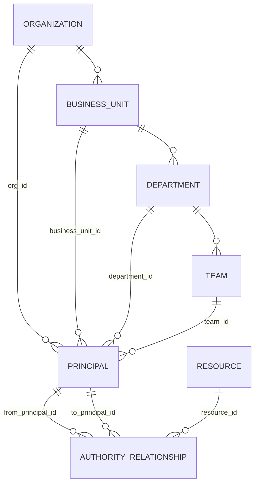
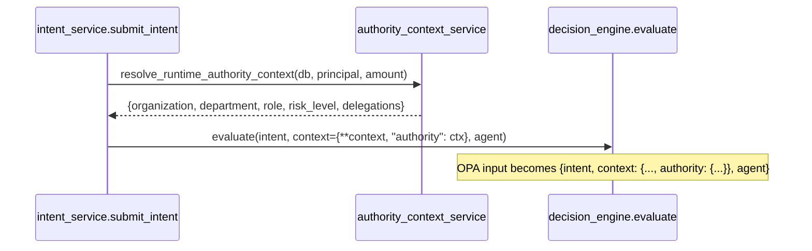

# Part 8 — Runtime Authority (Authority Model + Runtime Authority Context)

**Supersedes/synthesizes:** `PHASE_1_AUTHORITY_MODEL.md`, `PHASE_2_RUNTIME_CONTEXT.md`, `RUNTIME_AUTHORITY_TRANSFORMATION.md`, `UNIVERSAL_RUNTIME_AUTHORITY.md`, `RESOURCE_MODEL.md`, `OPERATION_MODEL.md`. Both phase docs still say `Status: proposed` in their own headers — both are implemented, migrated (`b58b031aeb21`, part of the `intent_service.py` change respectively), and live-verified. This part states their actual, current status.

## 8.1 What "Runtime Authority" means here, precisely

Two distinct but connected mechanisms share this name:

1. **The Authority Model** (Phase 1): a real organisational hierarchy and delegation graph — `BusinessUnit → Department → Team`, `Principal` attached to any level, and `AuthorityRelationship` extended with real `from_principal_id`/`to_principal_id`/`resource_id` foreign keys, temporal validity, and revocation.
2. **Runtime Authority Context** (Phase 2): an ephemeral, request-scoped enrichment of the OPA input, computed fresh on every Intent from the Authority Model above, so a `RuntimePolicy`'s conditions can reference an agent's organisational context (department, role, active delegations, risk band) without that context ever being persisted or treated as a pre-filter.

## 8.2 The Authority Model schema



Every level of the hierarchy is **optional** — `Principal.business_unit_id`/`department_id`/`team_id` are all nullable, and `BusinessUnit`/`Department`/`Team` are themselves independently optional levels. A customer with no department-level subdivision simply never populates `departments`; nothing forces a two- or three-level hierarchy where a flatter one is the truth. This was a deliberate design call, not an oversight: see [20_ARCHITECTURAL_ASSESSMENT.md](20_ARCHITECTURAL_ASSESSMENT.md) for why a rigid mandatory hierarchy would have been the wrong default.

`AuthorityRelationship` (originally an AI Authority Builder-only, informational table, §5.1/§9) was extended, not replaced, with the real enforceable edge:

| Column | Purpose |
|---|---|
| `from_principal`/`to_principal` (text) | **Extraction provenance** — exactly what the source document said. Never overwritten once resolved. |
| `from_principal_id`/`to_principal_id` (FK, nullable) | The resolved, real, traversable edge. `NULL` means "extracted but not yet resolved to a known Principal." |
| `resource_id` (FK, nullable) | What the delegation is over |
| `operation` | The verb the delegation grants |
| `valid_from`/`valid_to` | Temporary authority — a delegation can expire on its own without being explicitly revoked |
| `revoked_at`/`revoked_by`, `status` (`proposed/active/revoked/expired`) | Explicit revocation, independent of the validity window |
| `cross_org_approved` (default `false`) | **Fail-closed by default**: a delegation edge whose two principals resolve to different organisations is not honored in traversal unless this is explicitly set — a name resolving across an org boundary is never silently treated as a working delegation |

## 8.3 Runtime Authority Context: how it's resolved

`authority_context_service.resolve_runtime_authority_context(db, principal, amount)`:

```python
def resolve_runtime_authority_context(db, principal, amount) -> dict:
    if principal is None:
        return {"risk_level": classify_risk(amount)}
    return {
        "organization": _name_or_none(db, Organization, principal.organization_id),
        "business_unit": _name_or_none(db, BusinessUnit, principal.business_unit_id),
        "department": _name_or_none(db, Department, principal.department_id),
        "team": _name_or_none(db, Team, principal.team_id),
        "role": principal.role,
        "risk_level": classify_risk(amount),
        "delegations": _active_inbound_delegations(db, principal.id),
    }
```

`classify_risk(amount)` is a fixed risk band (`LOW < $50k ≤ MEDIUM < $100k ≤ HIGH < $250k ≤ CRITICAL`), a deliberate default judgment call in the absence of a spec-defined threshold — the same kind of call `agent_service.compute_health`'s heartbeat thresholds make (§11). `_active_inbound_delegations` queries `AuthorityRelationship` where `to_principal_id` matches the acting principal, `kind == 'delegation'`, `status == 'active'`, filtered by the current time against `valid_from`/`valid_to`.

## 8.4 Where this plugs into the pipeline



The result is merged into `context["authority"]` and passed to `decision_engine.evaluate()` on **every** Intent, unconditionally — it is never a pre-filter that decides which policies get evaluated. Every active `RuntimePolicy` is still evaluated by OPA exactly as before; a policy simply may or may not have a condition that reads `context.authority.department` (routed correctly to `input.context.authority.department` by the `rego_generator.py` fix, [07_RUNTIME_POLICY_ENGINE.md](07_RUNTIME_POLICY_ENGINE.md) §7.5). **Nothing about Runtime Authority Context is ever persisted** — it is computed fresh, request-scoped, and discarded after the Decision is made; only the Decision's `evaluated_mandates` and the Evidence payload record what happened, not this ephemeral enrichment itself.

## 8.5 Multi-tenancy: what's real today

**Updated, Milestone 2 (Multi-Tenant Foundation).** The Authority Model's `organization_id` columns (Principal, BusinessUnit, Department, Team, AuthorityRelationship — all Milestone 1) and the Runtime Policy tables' own `organization_id` columns (RuntimePolicyRecord, Policy, lifecycle/schedule tables — Milestone 2) together make this a genuinely multi-organisation-safe schema, not merely a "shaped for it" one. `get_current_organization` (§2.6) no longer has an implicit default for the Operator Key: a request authenticated with it must now name its target organisation explicitly (`X-PayReality-Organization-Id`); real per-user callers still resolve their own organisation via their session/API key, unchanged. `_check_broken_inheritance`/`_check_missing_principal` (Runtime Policy safety checks) verify a delegated-from or scoped Principal belongs to the SAME organisation as the candidate policy, not merely that it resolves to a real Principal at all — closing the one remaining place a cross-organisation Principal reference could previously go unnoticed.

Still genuinely open: `cross_org_approved` (§8.2) remains the one place a delegation is explicitly ALLOWED to cross an organisation boundary, by design, when a reviewer opts in — this is intentional multi-org federation, not a gap. What's still deferred as out-of-scope follow-up work: the frontend, Python SDK, and `scripts/smoke_test.py` still call org-scoped endpoints using the Operator Key with no target-organisation header (see [16_CURRENT_LIMITATIONS.md](16_CURRENT_LIMITATIONS.md) §16.5).

## 8.6 What's active vs. partial

| Component | Status |
|---|---|
| `BusinessUnit`/`Department`/`Team`/`Resource` tables, `Principal` extensions | **Active**, schema-complete, populated on a per-customer basis as onboarded |
| `AuthorityRelationship`'s real FK columns, temporal validity, revocation, `cross_org_approved` | **Active** |
| Runtime Authority Context resolution + merge into every Decision | **Active**, live-verified end-to-end (a real signed Intent's outcome flipped from `DENY` to `ALLOW` after the field-routing fix, using a condition on `context.authority.department`) |
| A frontend UI for editing the org hierarchy / delegation graph directly | **Not built** — today, `BusinessUnit`/`Department`/`Team`/`AuthorityRelationship` rows are populated via direct API calls or the AI Authority Builder's promotion flow, not a dedicated management page |
| Authority Model as a policy **pre-filter** (deciding which policies are even considered) | **Deliberately not built** — see §8.4; every policy is always evaluated, Authority Context only ever adds condition-checkable fields |
