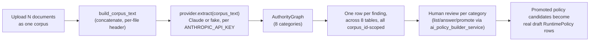

# Part 9 — AI Authority Builder

**Supersedes/synthesizes:** `AI_AUTHORITY_BUILDER_ARCHITECTURE.md`, `AI_EXTRACTION_PIPELINE.md`. Grounded directly in `services/ai_authority_builder_service.py` and `domain/ai_authority_builder/provider.py`.

## 9.1 What this is, and how it differs from the AI Policy Builder

The AI Authority Builder takes **multiple** documents at once (a "corpus" — an org chart, a delegation-of-authority policy, an approval matrix, whatever a customer has) and extracts a full **Authority Graph**: not just candidate policies, but the principals, resources, operations, relationships, conflicts, gaps, and open questions those documents collectively imply. The AI Policy Builder ([10_AI_POLICY_BUILDER.md](10_AI_POLICY_BUILDER.md)) is narrower and simpler by design: one document in, candidate `RuntimePolicy` drafts out. The two are parallel, independent pipelines, not one generalized into the other — see [10_AI_POLICY_BUILDER.md](10_AI_POLICY_BUILDER.md) §10.1 for why that separation was kept rather than collapsed.

## 9.2 The eight extraction categories (`AuthorityGraph`)

| Category | Table | What it captures |
|---|---|---|
| **Policies** | `policy_extraction_candidates` (`corpus_id` set, `upload_id` null) | Candidate `RuntimePolicy` drafts — reuses the AI Policy Builder's own `CandidateRuntimePolicy` type and `candidate_to_content` conversion unchanged |
| **Principals** | `authority_principals` | Discovered authority holders: name, role, who they report to |
| **Resources** | `authority_resources` | Discovered business objects (accounts, systems, contracts) |
| **Operations** | `authority_operations` | Discovered verbs/actions those principals can perform |
| **Relationships** | `authority_relationships` | Discovered links: `delegation`, `escalation`, or `inheritance` between two named principals |
| **Conflicts** | `authority_conflicts` | Contradictions or duplications the model noticed across the corpus |
| **Gaps** | `authority_gaps` | Information the model expected to find and didn't (an undefined approver, an unstated limit) |
| **Questions** | `authority_questions` | Clarification requests for a human reviewer |

Every category except Questions and Conflicts carries a `confidence` score and a `source_excerpt`/`source_location` citation — the model's own stated basis for the claim, always shown to the reviewer, never silently trusted. Conflicts have `reasoning` instead of a citation (a conflict is a relationship *between* findings, not one passage of text); Questions carry neither (a question is a request for information, not a claim to be confident about) — see the type definitions' own docstrings in `provider.py`, which state this distinction explicitly as a design rule, not an implementation accident.

## 9.3 Pipeline

`run_extraction` is entirely transactional per corpus: on any failure, `corpus.status` becomes `failed` with the error recorded, and the caller can retry without re-uploading — the same recovery posture every extraction pipeline in this platform follows (AI Policy Builder, and originally the now-retired legacy Authority/Mandate extraction). **Zero findings in any category is treated as a valid, ordinary outcome, not an error** — a corpus with no discoverable conflicts, for instance, simply produces zero `AuthorityConflict` rows.

## 9.4 Promotion: candidates become real policies through unmodified code

`AuthorityGraph.policies` (the one category shared with the AI Policy Builder) are stored in the exact same `policy_extraction_candidates` table the AI Policy Builder uses, distinguished only by `corpus_id` being set instead of `upload_id` (a database `CHECK` constraint enforces exactly one of the two is ever set — see [05_DATABASE.md](05_DATABASE.md) §5.4). Promotion, dismissal, and editing of a corpus-derived candidate reuse `ai_policy_builder_service.promote_candidate`/`dismiss_candidate`/`edit_candidate`/`get_candidate` — the Authority Builder's own service module never reimplements this logic, only writes into the same table those functions already read from. This is a deliberate reuse decision, not a missed abstraction: it means any future improvement to promotion logic (validation, permission checks) automatically applies to both pipelines with one code change.

**Updated, Milestone 2 (Multi-Tenant Foundation):** `promote_candidate` is no longer completely unmodified — it now takes the promoting caller's `organization_id` and, when the candidate's own `corpus_id` resolves to an `AuthorityCorpus` with an `organization_id` set, verifies the two agree (`CrossOrganizationPromotionError`, HTTP 409, otherwise) before the new `RuntimePolicyRecord` inherits the corpus's organisation. This closes one of the three independent, previously-uncross-validated paths to "organisation" the Milestone 2 dependency analysis found (`Principal.organization_id`, `AuthorityCorpus.organization_id`, and `RuntimePolicyRecord.organization_id`, which did not exist before this milestone at all). `dismiss_candidate`/`edit_candidate`/`get_candidate` remain genuinely unmodified.

## 9.5 What's informational vs. enforceable

This is the most important nuance in this subsystem: **most of the Authority Graph is informational, reviewed by a human, and never itself a formally verified graph** (see `AuthorityRelationship`'s own docstring: "Model-reported, reviewed by a human, not a formally verified graph edge"). Concretely:

| Finding type | What happens to it |
|---|---|
| Policy candidates | Can be promoted into a real, enforceable `RuntimePolicy` — the only category with a direct path into enforcement |
| Principals, Relationships | **Update (Authority-as-a-continuous-object, Stages E-F):** a reviewer-triggered, code-driven resolution path now exists — `resolve_principal` (match an existing `Principal` or create one) and `resolve_relationship`/`activate_relationship` (derive and activate the real `from_principal_id`/`to_principal_id` FKs). Still never automatic: every step requires an explicit reviewer action, gated by `AUTHORITY_REVIEW`, exactly the discipline this section originally called for |
| Resources, Operations, Conflicts, Gaps | Displayed for human review; a reviewer can manually create a real `Resource` row informed by them, but there is still no promotion path for these categories specifically |
| Questions | Answered directly, informational only |

This means the Authority Model (Part 8) and the AI Authority Builder's discovery output are now connected by code as well as reviewer judgment for Principals and Relationships specifically: a reviewer still decides whether and how to resolve a discovered relationship, but the act of resolving it, deriving real ids and (separately) activating them for live enforcement, is a real API call, not a manual "go create the equivalent row yourself" step. Resources/Operations/Conflicts/Gaps remain exactly as originally described here: informational only, no promotion path (see [16_CURRENT_LIMITATIONS.md](16_CURRENT_LIMITATIONS.md)).

## 9.6 Provider architecture (extraction backend)

Same vendor-neutral pattern used throughout this platform's AI-touching subsystems (extraction, AI Policy Builder): an `AuthorityGraphExtractionProvider` protocol (`.extract(corpus_text) -> AuthorityGraph`), with a real `claude_provider.py` (used when `ANTHROPIC_API_KEY` is configured) and a deterministic `fake_provider.py` fallback otherwise. `GET /v1/ai-authority-builder/status` reports which is active. See [16_CURRENT_LIMITATIONS.md](16_CURRENT_LIMITATIONS.md) for where this matters most: the hosted demo environment's AI providers are currently the fake/simulated ones, a known and named gap, not a hidden one.

## 9.8 Milestone 3 (Enterprise Surface Isolation): mutating endpoints gained organization checks

`_authorized_corpus` (§9's own gate, Milestone 1) always protected every corpus-scoped *read* correctly. `MULTI_TENANT_ARCHITECTURE_VERIFICATION.md`'s pre-Milestone-3 audit found the gap was entirely in the *mutating* endpoints downstream of discovery: `resolve_principal`, `resolve_relationship`, `activate_relationship`, `answer_question`, `approve_graph`, and the read endpoint `get_principal_candidates` gated solely on `Permission.AUTHORITY_REVIEW` — a capability check that says nothing about *whose* data is being touched. `approve_graph` was the worst instance: it took a `corpus_id` but never verified it belonged to the caller's organization, so any reviewer holding ordinary `AUTHORITY_REVIEW` in any organization could pull another organization's full corpus snapshot and write a falsely-attributed approval record into that organization's own audit trail.

Fixed with three new router-level dependencies, each resolving the target row's own corpus and comparing its `organization_id` against the caller's — `_authorized_authority_principal`, `_authorized_relationship`, `_authorized_question` — mirroring `_authorized_corpus`'s existing "cross-organization access looks like not-found" convention exactly. `approve_graph` now depends on `_authorized_corpus` directly, since it already took `corpus_id`.

**Disclosed, not fixed in this pass:** `AuthorityRelationship.cross_org_approved` (§8.2's fail-closed opt-in for legitimate cross-organization delegation) remains dead schema — defined on the model, never read anywhere in the codebase. `resolve_relationship`/`activate_relationship` still don't check whether the two PRINCIPALS involved in a relationship belong to the same organization as each other, only that the corpus belongs to the caller. Wiring this in is a genuine improvement, tracked as a follow-up, not implemented here (it was beyond this fix's literal "verify the target object belongs to the caller's organization" scope).

## 9.9 What's active vs. dead

| Component | Status |
|---|---|
| Corpus upload, 8-category extraction, per-category review endpoints | **Active** |
| Policy-candidate promotion (shared code path with AI Policy Builder) | **Active** |
| Automatic promotion of Principal/Resource/Relationship findings into real Phase 1 Authority Model rows | **Not built** — manual human action today |
| Real Claude-backed extraction | **Active when `ANTHROPIC_API_KEY` set**; **fake/simulated** on environments without it (see [16_CURRENT_LIMITATIONS.md](16_CURRENT_LIMITATIONS.md)) |
