# Part 10 — AI Policy Builder

**Supersedes/synthesizes:** `AI_POLICY_BUILDER_ARCHITECTURE.md`, `AI_EXTRACTION_PIPELINE.md`, `RUNTIME_POLICY_MAPPING.md`. Grounded directly in `services/ai_policy_builder_service.py` and `domain/ai_policy_builder/provider.py`.

## 10.1 What this is, and why it's a separate pipeline from the AI Authority Builder

The AI Policy Builder takes **one** document and extracts candidate `RuntimePolicy` drafts directly — no org-graph discovery, no principals/resources/relationships, just policies. It predates the AI Authority Builder (§9) and remains mounted as its own pipeline rather than being collapsed into the newer, broader one, for a concrete reason stated in the code itself: `domain/ai_policy_builder/provider.py`'s docstring notes it is a **deliberate sibling**, not a reuse, of the original legacy extraction protocol — "conflating the two would couple two independent domains for no benefit." The same reasoning is why the AI Authority Builder didn't replace this one either: a customer with a single, focused delegation document doesn't need the heavier eight-category corpus analysis to get a usable policy draft.

## 10.2 The `CandidateRuntimePolicy` shape

```python
CandidateRuntimePolicy(
    name, principal, action, effect,       # required — a candidate that can't name these isn't usable
    confidence, source_excerpt, source_location,   # the model's own, uncalibrated self-report
    resource=None,
    conditions: tuple[CandidateCondition, ...] = (),   # field, operator, value
    delegated_by=None, evidence_required=None, risk_level=None,
    metadata_owner=None, metadata_tags=(),
    missing_fields=(),                       # what the model couldn't find/infer
)
```

`confidence` and `missing_fields` are explicitly documented as the model's own self-report, "never assumed accurate" — the reviewer UI always shows both, rather than silently filtering low-confidence candidates or treating a high confidence score as a substitute for review.

## 10.3 Pipeline

```mermaid
flowchart LR
    A["Upload one document\n(PolicyExtractionUpload)"] --> B["extract_text\n(format-aware: pdf/docx/xlsx/csv/text)"]
    B --> C["provider.extract(document_text)\nClaude or fake"]
    C --> D["list[CandidateRuntimePolicy]"]
    D --> E["candidate_to_content\n-> PolicyExtractionCandidate rows,\nstatus=pending_review"]
    E --> F["Human review:\nedit / dismiss / promote"]
    F --> G["build_runtime_policy_from_candidate\n+ validate()"]
    G --> H["runtime_policy_service.create_policy\n(the ONE integration point)"]
    H --> I["Real draft RuntimePolicy,\nstatus=draft, version=1"]
```



On any extraction failure, the upload transitions to `failed` with the error recorded, retryable without re-upload — the same recovery posture as the AI Authority Builder and the original legacy extraction pipeline before it. **Zero candidates from a successfully extracted document is a valid outcome**, not an error — an irrelevant or empty document simply produces no candidates.

## 10.4 The one integration point, and why it's structurally narrow

`ai_policy_builder_service.py`'s own module docstring states the constraint plainly: *this module has no import of, and no access to, `deploy_policy`, the OPA client, or the `policies` table — "the AI must never deploy" is structural here, not just documented intent.* The only thing this pipeline is capable of producing is a **draft** (`PolicyStatus.DRAFT`), which then has to pass through the full authoring lifecycle (submit-for-review → approve → compile → deploy, [07_RUNTIME_POLICY_ENGINE.md](07_RUNTIME_POLICY_ENGINE.md) §7.10) with the same permissions and the same conflict detection as a manually authored policy. There is no code path — not a bug to fix, an absent import — by which an AI-extracted candidate reaches OPA without a human explicitly approving and publishing it at every step.

`promote_candidate` builds a real `RuntimePolicy` object (`build_runtime_policy_from_candidate`), runs it through the **same** `domain/runtime_policy/validators.validate()` every manually authored policy goes through, and only on success calls `runtime_policy_service.create_policy` — the unmodified function Policy Studio's manual authoring UI also calls. If validation fails, `promote_candidate` raises rather than silently creating an invalid draft; the candidate stays `pending_review` so a reviewer can fix the content and retry.

`build_runtime_policy_from_candidate` stamps a fresh `AuditTrail(created=now())` explicitly rather than leaving it to a default — the code comment notes this field's omission was a real, since-fixed production bug in Policy Studio's own manual create path (a partial-audit-merge regression), and this construction was written to avoid repeating it.

## 10.5 Candidate lifecycle

```
pending_review --edit--> pending_review (content replaced, same row)
pending_review --dismiss--> dismissed (terminal)
pending_review --promote--> promoted (terminal, promoted_policy_key set)
```

Editing and dismissing are only allowed while `pending_review` — a promoted or dismissed candidate is a closed record of what was decided, never revised afterward.

## 10.6 Format support and text extraction

`domain/ai_policy_builder/text_extraction.py::extract_text(format, content)` handles `pdf`, `docx`, `xlsx`, `csv`, and plain `text` (the same format set the DB `CHECK` constraint on `policy_extraction_uploads.format` and `authority_corpus_documents.format` enforces). This module is shared, unmodified, by both AI builders (§9's `build_corpus_text` calls the same `extract_text` per file).

## 10.7 Provider architecture

Same vendor-neutral pattern as every other AI-touching subsystem: `RuntimePolicyExtractionProvider` protocol, a real `claude_provider.py`, a deterministic `fake_provider.py` fallback, `GET /v1/ai-policy-builder/status` reporting which is active. See [16_CURRENT_LIMITATIONS.md](16_CURRENT_LIMITATIONS.md) for the hosted-demo caveat (fake providers active there today).

## 10.8 Milestone 3 (Enterprise Surface Isolation): the pipeline gained an organization concept for the first time

Before this milestone, `PolicyExtractionUpload`/`PolicyExtractionCandidate` had no organization column at all, and `list_uploads`, `get_upload`, `list_candidates_for_upload`, `list_candidates`, `get_candidate` were reachable with zero authentication (`MULTI_TENANT_ARCHITECTURE_VERIFICATION.md`). §9.4's `CrossOrganizationPromotionError` guard (Milestone 2) only ever fired for the `corpus_id` path — every single-document candidate has `corpus_id=None` by construction, so promotion never actually verified anything for this pipeline specifically.

Fixed: `PolicyExtractionUpload` gained a nullable `organization_id` column, stamped at upload time. `PolicyExtractionCandidate` deliberately does **not** get its own column — a candidate resolves its organization via exactly one of its two parents (`upload_id` → the new column, or `corpus_id` → `authority_corpora.organization_id`), mirroring the existing "resolve through the parent" convention every other corpus-scoped extraction table already uses. `list_candidates` (the general, filter-optional endpoint) is the one that actually closes the leak most directly: it previously returned every organization's candidates unconditionally when called with neither `upload_id` nor `corpus_id`; the fix requires `organization_id` and enforces it via an outer join through both possible parents at once. Every read endpoint now depends on `get_current_organization` (a new `_authorized_upload` router dependency mirrors `_authorized_corpus` for the two upload-keyed ones); `edit_candidate`/`dismiss_candidate`/`promote_candidate` all thread the same check through.

## 10.9 What's active vs. dead

| Component | Status |
|---|---|
| Single-document upload, extraction, review, promotion | **Active** |
| `promote_candidate` → `create_policy` integration | **Active**, structurally incapable of bypassing the authoring lifecycle |
| Real Claude-backed extraction | **Active when `ANTHROPIC_API_KEY` set**; fake otherwise |
| Frontend as the primary nav entry point for policy authoring | **Active** — `PolicyListPage` links here as one of three authoring entry points ([03_FRONTEND.md](03_FRONTEND.md) §3.7) |
