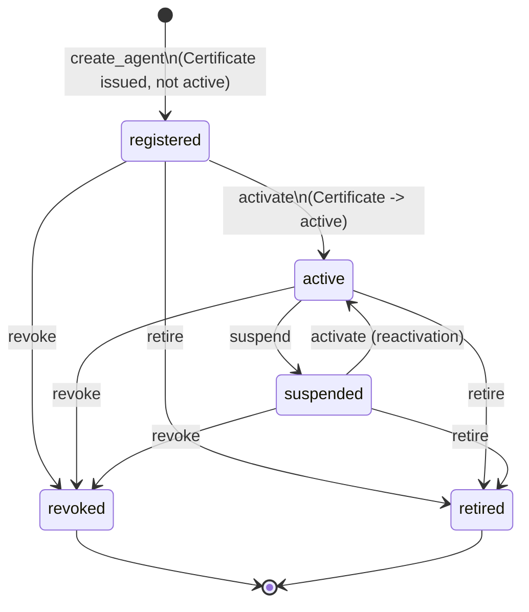
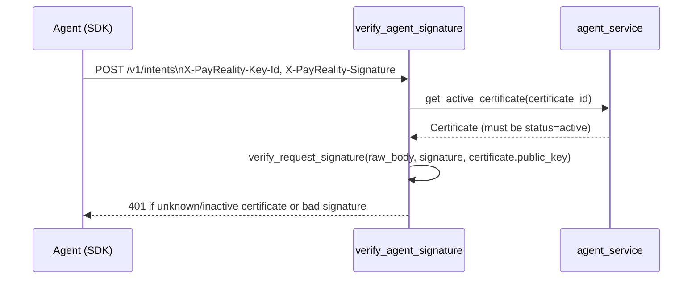

# Part 11 — Agent Architecture

**Supersedes/synthesizes:** `AGENT_LIFECYCLE.md`, `AGENT_DIRECTORY.md`, `CERTIFICATE_ROTATION.md`, `SDK_ARCHITECTURE.md`, `SDK_REFERENCE.md`, `SDK_AGENT_GUIDE.md`, `SDK_QUICKSTART.md`, `SDK_SECURITY.md`. Grounded in `services/agent_service.py` (full read this session) and `domain/auth/signature.py`.

## 11.1 What an Agent is

An Agent is a full enterprise identity with a lifecycle — not a static credential record. It is always acting **for** a Principal (the person/team/org that bears the risk), holds one or more Certificates (Ed25519 keypairs, public half only ever stored server-side), and every Intent it submits must be signed by its currently-`active` Certificate's private key.

## 11.2 The lifecycle state machine



`_ALLOWED_TRANSITIONS` (`agent_service.py`) is a plain dict of allowed destinations per source state, not a state-machine library — a deliberate scale call: five states and a handful of transitions doesn't earn that dependency. `revoked` and `retired` are both terminal and both reachable from any non-terminal state, but are semantically distinct: **retire** is an orderly decommission (the certificate is marked `expired`); **revoke** implies the certificate itself may be compromised (marked `revoked`) — not in the original spec's literal named-endpoint list, but added because "Revoked" is a required state in that same spec's own state machine section, and a state with no path to it is not really part of the model.

## 11.3 Certificates

| Status | Meaning |
|---|---|
| `issued` | Provisioned at registration, not yet usable to sign Intents |
| `active` | Exactly one per agent at a time (`idx_certificates_single_active`, a partial unique DB index — not just an application-level check) — the only status `verify_agent_signature` accepts |
| `rotated` | Superseded by a newer certificate; never deleted |
| `expired` | Set when its agent retires |
| `revoked` | Set when its agent is revoked, or independently if the key itself is suspected compromised |

**PayReality never holds a private key.** `rotate_certificate` only ever receives a new *public* key — the new keypair is generated agent-side (SDK) or by the caller. `request_certificate_rotation` exists specifically because of this constraint: it cannot generate a replacement key pair on an agent's behalf, so it only flags the agent for rotation (visible in the Directory, and to the agent's own next heartbeat/`authorize()` call) rather than fabricating a rotation that would require possessing key material the platform is specifically designed never to have.

## 11.4 Signed-request verification (`domain/auth/signature.py`)



`verify_request_signature` verifies an Ed25519 signature over the **raw request body bytes** — never raises on a bad signature (an invalid signature is data to reject, not an exceptional program state) — and accepts public keys stored either as `ed25519:base64:<...>` or plain base64. Replay protection is two-layered: `check_timestamp_window` rejects requests outside a configurable tolerance regardless of nonce, and actual nonce reuse is prevented by `intents`'s `UNIQUE(agent_id, nonce)` **database constraint** at insert time rather than a separate cache — a deliberate choice, since a DB constraint gives a stronger guarantee (no reuse ever, not just within a TTL window) and avoids a Redis dependency this platform doesn't otherwise need.

## 11.5 Audit trail (`AgentAuditEvent`)

Every lifecycle transition (created, activated, suspended, reactivated, revoked, retired, certificate rotated, owner changed) produces one signed, immutable row — using the **exact same** `sign_payload`/`canonicalize` primitives as Decision Evidence ([13_EVIDENCE_ENGINE.md](13_EVIDENCE_ENGINE.md)), reused unchanged. This is a deliberate parallel: an audit event is just as independently verifiable as any other Evidence record, even though it lives in its own table rather than relaxing `Evidence.decision_id` to nullable (the Agent Detail page's own design already lists "Decision History," "Evidence," and "Audit" as three distinct sections). **Heartbeats do not produce an audit row** — at 10,000+-agent scale, a row every few minutes per agent would flood the ledger for no auditing value; a heartbeat only updates `Agent.last_seen_at` (and optionally `version`/`sdk_version`/`runtime`).

## 11.6 Health computation

`compute_health(agent, now)` — a pure function, no DB query beyond the agent row already loaded — derives one of `healthy` / `warning` / `offline` / `unknown` from `last_seen_at`:

| Condition | Health |
|---|---|
| `agent.status not in (active, suspended)` | `unknown` — never expected to be reporting in the first place |
| `last_seen_at is None` | `offline` |
| age ≤ 5 minutes | `healthy` |
| age ≤ 30 minutes | `warning` |
| age > 30 minutes | `offline` |

These thresholds are a deliberate default judgment call in the absence of a spec-defined value — the same kind of call `authority_context_service.classify_risk`'s risk bands make (§8.3).

## 11.7 Agent Directory: search, filter, bulk operations

`list_agents` supports filtering by `status`, `environment`, `owner`, `principal_id`, and a name substring (`q`), with real pagination (`limit`/`offset` plus a total count) — necessary once "manage 10,000+ agents" is a real requirement, not a nice-to-have. `bulk_transition` processes each agent **independently**: one invalid transition in a batch of a thousand doesn't abort the other 999, and each result reports its own `ok`/`error`. This is explicitly **not** a single set-based `UPDATE` — fine for the batch sizes an operator drives from the Directory UI, but a known scaling limit at true bulk-migration scale (see [16_CURRENT_LIMITATIONS.md](16_CURRENT_LIMITATIONS.md)).

## 11.8 The SDK (`sdk-python/`)

A small, focused Python package (`payreality/`: `agent.py`, `auth.py`, `client.py`, `configuration.py`, `crypto.py`, `exceptions.py`, `models.py`, `retry.py`) whose entire public surface is meant to be the `Agent` class:

```python
from payreality import Agent
agent = Agent(api_key="...", private_key="...", organization_id="...")
decision = agent.authorize(principal="Finance Manager", operation="Approve",
                            resource="Vendor Payment", resource_data={"amount": 85000, "vendor": "ABC Ltd"})
```

- **Key generation and storage are entirely client-side.** `Agent.__init__` generates a keypair automatically if not given an explicit `private_key`; `register()` is idempotent per key (calling it again with the same private key returns the identity already on file rather than re-registering), and a `CredentialStore` persists the mapping from public key to the server-assigned identity locally.
- **`_resolve_principal_id`** is a concrete, real example of the operator-key/RBAC layering interaction (§2.6, §14): looking up an existing Principal by name is a plain read, but creating a new one passes `operator_auth=True` — meaning today's SDK, out of the box, needs the shared operator key configured to onboard a brand-new Principal, not just a scoped API key. This is one of the platform's known, named current gaps (see [16_CURRENT_LIMITATIONS.md](16_CURRENT_LIMITATIONS.md)): the SDK's default flow assumes an operator-level credential is available, which is a broader grant than a production integration should typically need for routine agent onboarding.
- **`organization_id` (Milestone 3, SDK `0.2.0`).** The Operator Key became platform-admin-only in Milestone 2 — it belongs to no single organization, so every operator-authenticated call must now also name one explicitly (`X-PayReality-Organization-Id`). `HttpClient.request`'s `operator_auth` path raises the same clear `AuthenticationError` for a missing `organization_id` it already raised for a missing `api_key`. A real, independent bug was also found and fixed in the same pass: `_resolve_principal_id`'s own `GET /v1/principals` call sent zero credentials of any kind, 401'ing on every real deployment since Milestone 1 gated that endpoint — masking the `organization_id` requirement, since `register()` never got far enough to need it.

## 11.10 Milestone 3 (Enterprise Surface Isolation): every agent endpoint gained an organization check

`MULTI_TENANT_ARCHITECTURE_VERIFICATION.md`'s pre-Milestone-3 audit confirmed `GET /v1/agents` and `GET /v1/agents/{id}` had no organization check at all. Auditing every agent endpoint per this milestone's own explicit scope found the same gap on `create_agent` (a client could register an Agent acting for a Principal belonging to a *different* organization), every single-agent mutation (`update`/`delete`/`activate`/`suspend`/`retire`/`revoke`/`rotate`/`transfer`, plus certificate/audit-event reads), and all four bulk operations (suspend/activate/retire/rotate by `agent_id` list).

`Agent` has no `organization_id` of its own — it's reachable only via `acting_for_principal_id` → `Principal.organization_id`. Fixed with a new `_authorized_agent` router dependency that resolves that chain once and 404s an agent belonging to a different organization identically to one that doesn't exist (the same convention `_authorized_corpus` established), applied to every single-agent endpoint except `heartbeat` — already correctly self-scoped via its own signature verification, since an agent can only ever act as itself. `list_agents` now filters via an inner join through `Principal` (`acting_for_principal_id` is `NOT NULL`, so the join never drops a legitimate row); `bulk_transition` checks each `agent_id` in a batch before acting, rejecting any belonging to a different organization as `agent_not_found` without ever calling the underlying transition.

## 11.11 What's active vs. partial

| Component | Status |
|---|---|
| Full lifecycle state machine, Certificates, audit trail, health, Directory search/bulk ops | **Active**, live-verified |
| Ed25519 request signing + replay protection | **Active** |
| Python SDK | **Active**, but its default onboarding flow's dependency on the shared operator key for principal creation is an unresolved rough edge (§11.8, [16_CURRENT_LIMITATIONS.md](16_CURRENT_LIMITATIONS.md)) |
| A column-level sort parameter on the Agent Directory list endpoint | **Not built** — always `created_at desc`, a named limitation in `AGENT_DIRECTORY.md` that remains true today |
