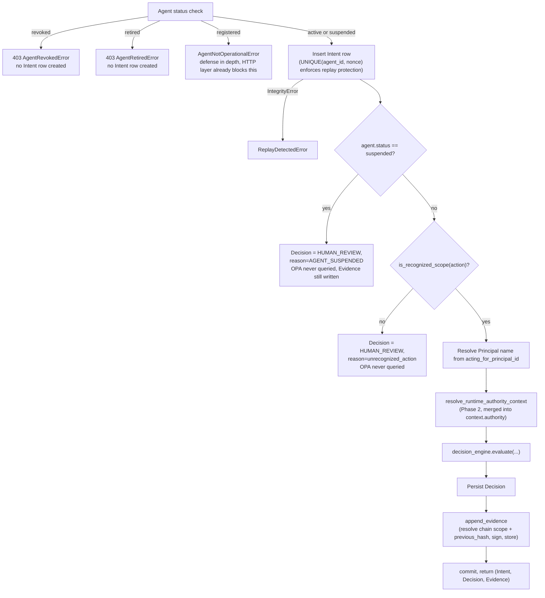

# Part 12 — Decision Engine

**Supersedes/synthesizes:** `ARCHITECTURE.md` (decision section), `PHASE_2_RUNTIME_CONTEXT.md`. Grounded directly in `domain/decision/engine.py` and `services/intent_service.py::submit_intent`, both read in full this session.

> **Sequence note (Runtime Governance Architecture, Phase 4):** §12.4's flowchart below predates the Phase 3 Runtime Truth extraction and still shows Principal-name resolution and Runtime Authority Context assembly as two separate boxes. They are now one call, `runtime_truth_service.resolve()`. The rest of this section's prose and its fail-closed table (§12.5) remain accurate. For the current, staged pipeline sequence, see [37_PHASE_4_ENTERPRISE_DECISION_PIPELINE_SPEC.md](37_PHASE_4_ENTERPRISE_DECISION_PIPELINE_SPEC.md) and [38_PHASE_4_PIPELINE_SEQUENCE_DIAGRAM.md](38_PHASE_4_PIPELINE_SEQUENCE_DIAGRAM.md).

## 12.1 The engine itself: pure, fail-closed by construction

`domain/decision/engine.py::evaluate()` has **no DB access** — it is pure orchestration over two injected protocols (`PolicyStore.get_active()`, `OpaClient.query()`), which is what makes it unit-testable against fakes independent of any real OPA/DB integration. This is a direct port of the platform's original spec algorithm, unchanged since.

```python
def evaluate(intent, context, acting_for_principal_id, policy_store, opa_client, timeout_ms=200) -> Decision:
    try:
        active_policy = policy_store.get_active()
    except NoActivePolicyError:
        return Decision(outcome="HUMAN_REVIEW", reason="no_active_policy")
    try:
        result = opa_client.query(build_opa_input(intent, context, acting_for_principal_id, active_policy.version), timeout_ms)
    except OPATimeoutError:
        return Decision(outcome="HUMAN_REVIEW", reason="opa_timeout", policy_id=active_policy.id)
    except OPAEvaluationError as e:
        return Decision(outcome="HUMAN_REVIEW", reason=f"opa_error:{e.code}", policy_id=active_policy.id)
    if result.get("requires_review") is True:
        return Decision(outcome="HUMAN_REVIEW", reason=result.get("review_reason"), ...)
    if result.get("allow") is True and result.get("deny") is not True:
        return Decision(outcome="ALLOW", ...)
    if result.get("deny") is True:
        return Decision(outcome="DENY", reason=result.get("deny_reason"), ...)
    return Decision(outcome="HUMAN_REVIEW", reason="undetermined")   # anything undetermined
```

**There is exactly one code path to `ALLOW`** — `result.get("allow") is True and result.get("deny") is not True` — and every other path, including every exception type, resolves to `HUMAN_REVIEW`. This is Principle 8 (fail-closed) enforced at the type/control-flow level, not by convention or by a reviewer remembering to add a check: a future edit that added a new failure mode without a matching `except` clause would raise, not silently `ALLOW`.

## 12.2 `build_opa_input`: the exact OPA input shape

```python
def build_opa_input(intent, context, acting_for_principal_id, policy_version) -> dict:
    return {
        "intent": intent,
        "context": context,
        "agent": {"acting_for_principal_id": acting_for_principal_id},
        "policy_version": policy_version,
    }
```

`context` is a **sibling** of `intent`, not nested under it — this is the exact fact that the `rego_generator.py` field-routing bug ([07_RUNTIME_POLICY_ENGINE.md](07_RUNTIME_POLICY_ENGINE.md) §7.5) got wrong before this session's fix, and the exact fact any future condition-authoring feature must respect. `policy_version` is passed through but not referenced anywhere in the Rego bundle_builder.py generates today ([07_RUNTIME_POLICY_ENGINE.md](07_RUNTIME_POLICY_ENGINE.md) §7.6) — it exists for future use and for whatever OPA-side debugging value it has, not because current policies condition on it.

## 12.3 Where "the active policy" actually comes from — read this before assuming

`intent_service.py`'s `_DbPolicyStore` adapts the **legacy** `policies` table to the engine's `PolicyStore` protocol — `select(Policy).where(Policy.status == 'active')`. This table was never migrated away from when Compiler V2 replaced the legacy authoring pipeline; instead, `runtime_policy_service.deploy_policy` writes a fresh row into it on every deploy ([07_RUNTIME_POLICY_ENGINE.md](07_RUNTIME_POLICY_ENGINE.md) §7.11), retiring the previous one, so the unmodified Decision Engine keeps resolving "is there an active policy, and what's its id/version" without ever being touched. **The `(id, version)` this returns does not determine what Rego OPA evaluates** — OPA always evaluates whatever bundle was most recently `upload_policy`'d to it by `deploy_policy` — it only supplies `Decision.policy_id` and the `policy_version` field of the OPA input. Confirmed directly against production for this specification: `policies` currently holds 5 rows (1 active, 4 retired), all created by `deploy_policy`, none by the retired legacy pipeline. Treating this table as "empty/dead legacy cruft" — a reasonable first guess given the four genuinely dead tables sitting right next to it in the same file — would be a wrong assumption with real consequences for anyone reasoning about this system's behavior.

## 12.4 `submit_intent`: the full pipeline, in order



Three findings worth stating explicitly, each a real bug this session's own history or code comments confirm was caught in practice, not hypothetical:

- **Revoked/retired agents never get an Intent row at all** — rejected at the service boundary with no evidentiary trail, because these are terminal states with no standing to act. A **suspended** agent is different: its Intent *is* recorded, and a Decision + Evidence *are* still created (`HUMAN_REVIEW`/`AGENT_SUSPENDED`, OPA never queried) — because suspension is temporary and reviewable, and the evidentiary trail of "what was attempted while suspended" has real value.
- **`RuntimePolicy.scope.principal` is authored as a free-form name string, never a foreign key** — but `Agent.acting_for_principal_id` is a UUID. The compiled Rego's scope match compares `input.agent.acting_for_principal_id` against that name string, so `submit_intent` must resolve the Principal's real `name` before ever building the OPA input. The code comment on this exact line states plainly what happens if this resolution is skipped: "every real Intent silently falls through to the `no_policy_covers_scope` fallback regardless of amount" — a subtle, silent-failure class of bug that would produce no error, just universally wrong `DENY` outcomes.
- **An unrecognized action resolves to `HUMAN_REVIEW`, never `DENY`** — an action `is_recognized_scope` doesn't know about is ambiguous, not explicitly disallowed, and OPA is never even queried for it.

## 12.5 Fail-closed outcomes, exhaustively

| Situation | Outcome | OPA queried? |
|---|---|---|
| Agent revoked or retired | Request rejected (403), no Intent/Decision/Evidence at all | No |
| Agent suspended | `HUMAN_REVIEW` / `AGENT_SUSPENDED` | No |
| Unrecognized action | `HUMAN_REVIEW` / `unrecognized_action` | No |
| No active policy (`policies` table has zero `active` rows) | `HUMAN_REVIEW` / `no_active_policy` | No |
| OPA timeout | `HUMAN_REVIEW` / `opa_timeout` | Attempted |
| OPA evaluation error | `HUMAN_REVIEW` / `opa_error:<code>` | Attempted |
| OPA returns `requires_review: true` | `HUMAN_REVIEW` / policy's own `review_reason` | Yes |
| OPA returns `allow: true`, `deny` not true | `ALLOW` | Yes |
| OPA returns `deny: true` | `DENY` / policy's own `deny_reason`, or `no_policy_covers_scope` if nothing matched | Yes |
| Anything else (OPA response shape not matching any of the above) | `HUMAN_REVIEW` / `undetermined` | Yes |

Every row resolves to something other than silent success — this table is the concrete evidence for §1.6/§1.7's "fail-closed by construction" claim.

## 12.6 What's active vs. partial

| Component | Status |
|---|---|
| `evaluate()`, `build_opa_input`, all fail-closed paths | **Active**, unchanged since original build, still the exact function every newer subsystem (Compiler V2, Runtime Authority Context) was deliberately built to feed without modifying |
| Suspended-agent / unrecognized-action / revoked-retired handling | **Active** |
| `policy_version` in the OPA input actually being condition-checkable | **Not used** by any shipped policy today — present in the input, absent from generated Rego (§12.2) |
