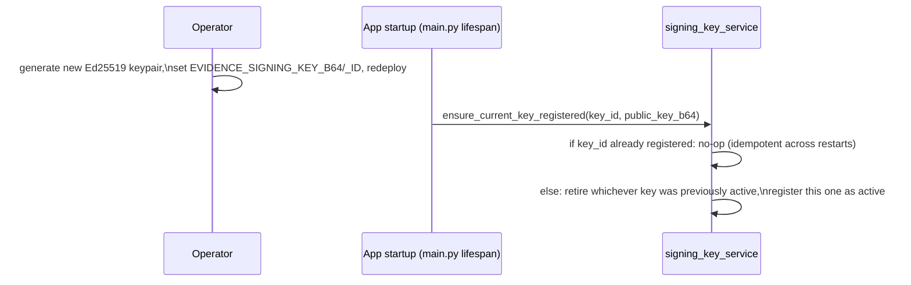
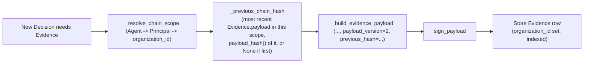

# Part 13 — Evidence Engine

**Supersedes/synthesizes:** `PHASE_5_EVIDENCE.md`, `EVIDENCE_KEY_ROTATION.md`, `SECURITY.md` (evidence section). `PHASE_5_EVIDENCE.md` still says `Status: proposed`; chaining is implemented, migrated (`411edb414123`), and live-verified. Grounded in `domain/evidence/signing.py`, `services/evidence_service.py`, `services/signing_key_service.py`, `routers/evidence.py`, all read in full this session.

## 13.1 What makes Evidence independently verifiable

Every Evidence record is signed over a **canonical** serialization of its payload — sorted keys, no incidental whitespace (`canonicalize`, `json.dumps(payload, sort_keys=True, separators=(",", ":"))`) — so the exact same logical payload always produces the exact same byte sequence, which is what makes signing and re-verification reproducible by anyone, not just this server. `sign_payload` signs `SHA-256(canonical_bytes)` with Ed25519; `verify_payload` re-serializes, recomputes the digest, and checks it against a published public key. **`verify_payload` never raises** — a bad signature is data to report, not an exceptional program state — and a `False` result is documented as a P1-severity signal the caller must surface, never silently swallow.

## 13.2 Key rotation: the signing-key registry (`SigningKey` / `signing_key_service.py`)

Before this registry existed, verification always checked a stored signature against whichever key was **currently configured** — meaning rotating the signing key, for any reason including routine security hygiene, would have silently made every previously-signed record permanently unverifiable. The fix:



`ensure_current_key_registered` runs once at app startup, not per-request — a registry maintenance step. It is the **entire** rotation mechanism: an operator generates a new keypair, sets two env vars, redeploys; this function does the rest the moment the new process boots. A `key_id` whose registered public key doesn't match what's currently configured is treated as a serious anomaly (key reuse with different material, or registry tampering) and is **never** silently overwritten — it's logged as an error requiring manual investigation.

`get_public_key_for_key_id(key_id)` is what makes verification correct across a rotation: every `Evidence`/`AgentAuditEvent` record stores its own `key_id`, and verification resolves the public key that was actually active **when that specific record was signed**, not whatever key happens to be configured today. `GET /v1/evidence/verification-keys` publishes the full history (active + retired) so a third party can verify a record signed under any key, at any point, without needing this server's cooperation beyond that one public endpoint.

## 13.3 Evidence chaining (Phase 5)

`Evidence.organization_id` is the chain's scope key — resolved via `Agent → Principal → organization_id` at write time (the same path Runtime Authority Context, [08_RUNTIME_AUTHORITY.md](08_RUNTIME_AUTHORITY.md), already resolves). **`NULL` is itself a valid, consistent chain scope**, not an error state — every Evidence record for a Principal with no organisation set yet (almost all of them, today) chains together as one scope, rather than chaining being a no-op until real org data exists.



`payload_hash(payload) = SHA-256(canonicalize(payload)).hexdigest()` — the same canonical serialization signing itself uses, so the hash a later record's `previous_hash` must match is exactly as reproducible as a signature is. `idx_evidence_organization_created (organization_id, created_at)` exists specifically because finding "the most recent prior record in this scope" must be a fast, targeted query on **every single Evidence write**, not a re-join through Decision → Intent → Agent → Principal every time.

**Historical (v1) records never had a `previous_hash` field at all** — their absence of `payload_version`/`previous_hash` is itself how a reader identifies a pre-chaining record, never retroactively added, and their signature/verification story is completely unaffected by this change.

## 13.4 Chain verification (`verify_chain`, `GET /v1/evidence/chain/verify`)

```python
def verify_chain(db, organization_id, since=None) -> ChainVerificationResult:
    records = <Evidence in scope, ordered by (created_at, id)>
    expected_previous = payload_hash(<record immediately preceding this range, if any>.payload) or None
    for record in records:
        valid, _ = verify_evidence(db, record.id, organization_id)  # signature check, unchanged
        if not valid: invalid_signatures.append(record.id)
        if "previous_hash" in record.payload:
            if record.payload["previous_hash"] != expected_previous:
                broken_links.append(record.id)
        expected_previous = payload_hash(record.payload)
    return ChainVerificationResult(total, invalid_signatures, broken_links)
```

This checks **two independent properties**, and the distinction matters: `invalid_signatures` catches a record whose payload was altered after signing (the existing, pre-Phase-5 guarantee); `broken_links` catches something signature-checking alone cannot — **a deleted or reordered record**. Every surviving record's own signature can check out perfectly while the chain still shows a gap exactly where a deleted record used to be, because the next surviving record's `previous_hash` no longer matches what `payload_hash` computes over its new (wrong) predecessor. Seeding `expected_previous` from whatever precedes the queried range (rather than assuming the range's start is the chain's true start) means a real gap sitting right at a `since` boundary is still caught, not silently assumed fine just because verification happened to start mid-chain.

**Corrected, Milestone 3 (see §13.8):** this section previously claimed live verification had confirmed `GET /v1/evidence/chain/verify` returns `intact: true` against a real chain. That claim was **false** — the internal `verify_evidence(db, record.id)` call shown above was actually missing its required `organization_id` argument, a `TypeError` on the very first iteration for any organization with real data. The claim was never re-tested after being written; it should have been marked **Unverified**, not stated as confirmed. The pseudocode above reflects the fixed call.

## 13.5 Evidence status vs. verification — two different questions

`Evidence.status` (`VERIFIED`/`PENDING`/`REJECTED`) reflects the **associated Decision's finality at creation time** — `ALLOW`→`VERIFIED`, `DENY`→`REJECTED`, `HUMAN_REVIEW`→`PENDING` until resolved — not a live cryptographic check. `POST /v1/evidence/{id}/verify` is the actual signature check, and is intentionally a separate, repeatable operation from `status`. Do not conflate the two: a `VERIFIED`-status record could in principle fail a live `/verify` call if something were wrong (which is exactly the P1 signal §13.1 describes), and a `PENDING`-status record's signature is just as independently checkable as any other.

## 13.6 HUMAN_REVIEW resolution: append, never mutate

`resolution_service.resolve_decision` appends a **second** Evidence record when a human resolves a `HUMAN_REVIEW` decision (approve or deny) — the original Decision row and its original Evidence record are never edited. `DecisionResolution` (one row per Decision, `UNIQUE(decision_id)`) records `resolution`, `resolved_by`, `reason`, and the `evidence_id` of that second record. This is what makes "the Decision row is immutable after creation" (§1.7) literally true rather than aspirational.

## 13.8 Milestone 3 (Enterprise Surface Isolation): the chain-verification crash

`MULTI_TENANT_ARCHITECTURE_VERIFICATION.md`'s pre-Milestone-3 audit confirmed `GET /v1/evidence/chain/verify` — the one endpoint built specifically for credential-free third-party verification (§13.4) — raised `TypeError` for any organization with at least one Evidence record, with zero prior test coverage. `verify_chain` called its own module's `verify_evidence(db, record.id)`, omitting the required `organization_id` argument `verify_evidence` had gained during Milestone 1's org-scoping pass. Fixed with a one-line change (pass the same `organization_id` `verify_chain`'s own query already scoped `records` to); two new tests (`test_evidence_chain_verification.py`) prove the fix and that no exception escapes for a populated organization. The rest of the Evidence Platform (`get_evidence`/`list_evidence`/`verify_evidence`, the `/organization/exports/evidence` download endpoint) was already correctly organization-scoped and required no changes.

## 13.9 What's active vs. partial

| Component | Status |
|---|---|
| Canonical signing, verification, published keys | **Active**, foundational since before this session |
| Signing-key rotation registry | **Active**, live (startup-idempotent, verified across a real restart) |
| Evidence chaining (`organization_id`, `previous_hash`, `verify_chain`) | **Active**, migrated and live-verified this session |
| Chain verification exposed per-organisation via a public endpoint | **Active** — `GET /v1/evidence/chain/verify` requires no auth, matching the "independently verifiable by a third party" design goal |
| A UI surfacing chain-verification results (not just per-record verify) | **Not built** — `LiveEvidence.tsx` exposes per-record verify; the chain-verify endpoint has no dedicated frontend view yet (see [16_CURRENT_LIMITATIONS.md](16_CURRENT_LIMITATIONS.md)) |
