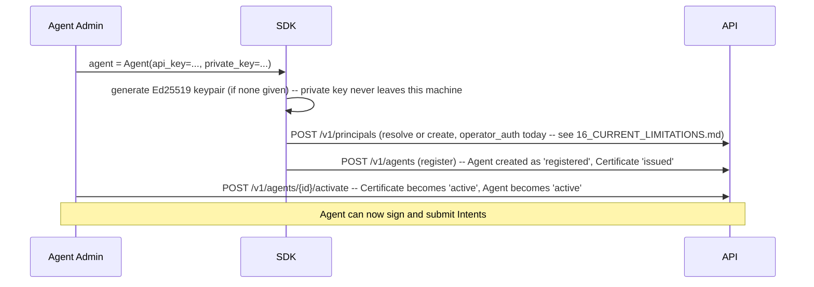

# Part 15 — User Journeys

**Supersedes/synthesizes:** scattered walkthroughs across `ORGANISATION_SETTINGS.md`, `AGENT_DIRECTORY.md`, `POLICY_STUDIO_WORKFLOW.md`, `RBAC.md`. This part is the single place all five roles' end-to-end journeys are told together, cross-referenced to the parts that cover each step in depth.

## 15.1 Owner — first-run setup

1. `POST /v1/auth/setup-owner` (public, first-run only) creates the first `Organization` and the first `User` (role `owner`). See [14_SECURITY_MODEL.md](14_SECURITY_MODEL.md) §14.3.
2. Logs in (`/login` → `POST /v1/auth/login` → session token stored client-side). See [03_FRONTEND.md](03_FRONTEND.md) §3.6 for the frontend's auth-state handling.
3. Visits **Organisation Settings** (`/organization`) to set timezone, default currency/language, and any org-level settings (session timeout, MFA requirement flag). See [08_RUNTIME_AUTHORITY.md](08_RUNTIME_AUTHORITY.md) §8.5 for what "one Organisation" means today.
4. Visits **Users** (`/organization/users`) to invite the first `governance_admin` / `agent_admin` / `reviewer` / `auditor` — each invited with a role, never with hand-picked individual permissions (§14.2).
5. Issues the first API key (for the SDK or an external integration) via `POST /v1/organization/api-keys` — shown once, never retrievable again.

## 15.2 Agent Admin — onboarding a new AI agent

Full lifecycle detail: [11_AGENT_ARCHITECTURE.md](11_AGENT_ARCHITECTURE.md). The Agent Admin can later suspend (temporary lock), rotate its certificate (planned key change, old cert → `rotated`), or retire/revoke it (terminal) — all from the Agent Directory or Detail page, all producing a signed audit event.

## 15.3 Governance Admin — authoring and publishing a policy, three ways

**Path A — Manual, in Policy Studio:**
1. `/governance/new` → author scope (principal, action, optional agent/resource), conditions, effect directly in the editor.
2. Submit for review → (a `governance_admin` or the same person if also holding `AUTHORITY_REVIEW`) approves.
3. Compile (`RUNTIME_POLICY_EDIT`) → review the diagnostics if it fails, or the dry-run result if it passes.
4. Deploy (`RUNTIME_POLICY_PUBLISH`) — the only step that ever writes to OPA.

**Path B — AI Policy Builder, single document:**
1. `/governance/upload` → upload one delegation-of-authority-style document.
2. Review extracted candidates (`/governance/upload/:uploadId`) — edit, dismiss, or promote each.
3. A promoted candidate becomes a real `draft` `RuntimePolicy` and re-enters Path A at step 2.

**Path C — AI Authority Builder, multi-document corpus:**
1. `/governance/authority-builder` → upload several documents as one corpus.
2. Review all eight extraction categories (`/governance/authority-builder/:corpusId`) — principals, resources, operations, relationships, conflicts, gaps, questions, and policy candidates.
3. Policy candidates promote exactly like Path B, step 3; other findings inform a reviewer's manual decisions elsewhere (there is no automatic promotion for those — see [09_AI_AUTHORITY_BUILDER.md](09_AI_AUTHORITY_BUILDER.md) §9.5).

Full detail: [07_RUNTIME_POLICY_ENGINE.md](07_RUNTIME_POLICY_ENGINE.md), [09_AI_AUTHORITY_BUILDER.md](09_AI_AUTHORITY_BUILDER.md), [10_AI_POLICY_BUILDER.md](10_AI_POLICY_BUILDER.md).

## 15.4 Reviewer — resolving a `HUMAN_REVIEW` decision

1. An Agent's Intent resolves to `HUMAN_REVIEW` (any of the reasons in [12_DECISION_ENGINE.md](12_DECISION_ENGINE.md) §12.5 — a genuine policy match requiring review, an unrecognized action, a suspended agent, or no active policy at all).
2. A Reviewer (holding `DECISIONS_RESOLVE`) inspects it via `/decisions` or the Decision detail, and calls `POST /v1/decisions/{id}/resolve` with `approved` or `denied` and a reason.
3. `resolution_service` appends a **second** Evidence record (never mutating the original) and a `DecisionResolution` row. See [13_EVIDENCE_ENGINE.md](13_EVIDENCE_ENGINE.md) §13.6.

## 15.5 Auditor — verifying the trail independently

1. Reads Evidence directly (`/evidence`, `GET /v1/evidence`) — no special permission needed for the read itself beyond whatever the deployment's auth posture requires.
2. Fetches the current or historical public key (`GET /v1/evidence/verification-key(s)`) — no server cooperation needed beyond this one published value.
3. Re-verifies a specific record's signature (`POST /v1/evidence/{id}/verify`) or a whole organisation-scoped chain (`GET /v1/evidence/chain/verify`) — both checkable by a tool the auditor controls entirely, using only the published key and the record(s) in question.
4. Exports evidence in bulk (`GET /v1/organization/evidence/export`) for offline analysis.

This journey is the concrete referent for §1.5's "what the customer holds afterward" — it's not a hypothetical capability, every step above is a real, callable endpoint.

## 15.6 Executive — reading Assurance

1. `/assurance` — live counts (agents by status, active policy, decisions by outcome), recomputed from the database on every load, never a cached or seeded "governance score."
2. This is the one journey with the narrowest permission set (`assurance.view` only) — an Executive's role cannot resolve a decision, approve a policy, or touch an agent, only observe.

## 15.7 Governance Admin — connecting a Trusted Integration (Settings → Integrations)

Full mechanism: [50_TRUSTED_INTEGRATION_ARCHITECTURE.md](50_TRUSTED_INTEGRATION_ARCHITECTURE.md). This is the admin journey for wiring up the Adapter-mediated runtime path; nothing here is required for the agent-direct path (§15.2–§15.3), which is unaffected.

1. **Connect a System** — Settings → Integrations → "Connect system," name only (e.g. "SAP S/4HANA"). Requires `integration_contract.manage`.
2. **Create an Action Mapping** — from the System's detail page, "Create mapping": the external system's own operation name (`source_operation`, e.g. `ChangeSupplierBankDetails`), the canonical action it means (`canonical_action`, e.g. `vendor_payment`), and which fields (resource/amount/currency/fact-subject/context) the mapping declares extractable. Starts `draft`.
3. **Validate the mapping** — re-checks every semantic field deterministically and freezes a `content_hash`. `draft → validated`, requires `integration_contract.manage`.
4. **Approve the mapping** — a named human accepts the now-immutable mapping. `validated → approved`, requires the stronger `integration_contract.publish`. Multiple approved versions of the same mapping may coexist (§50.12) — the UI never implies there is one "current" version.
5. **Register a Trusted Connection** — Settings → Integrations → "Register trusted connection": generates an Ed25519 keypair client-side, shows the private key material **exactly once**, never persisted server-side (the same one-time-reveal discipline as Agent registration, deliberately stricter — see [11_AGENT_ARCHITECTURE.md](11_AGENT_ARCHITECTURE.md) §11.3 for the precedent). Requires `integration_identity.manage`.
6. **Configure a Runtime Connection** — combine the Trusted Connection, an approved Action Mapping, an environment (`production`/`staging`/…), and an explicit, individually-checked list of allowed Agents. There is no "all agents" option. Starts `draft`, requires `integration_contract.manage`.
7. **Activate the Runtime Connection** — requires `integration_contract.publish`. Enforces every activation prerequisite in one atomic step (§50.13): Trusted Connection active, mapping approved, allow-list non-empty and every allow-listed Agent itself active. This is the actual deployment moment — nothing before it makes the mapping live.
8. **Test the connection** — from the same session as Trusted Connection registration only (the private key exists solely in the browser's in-memory state, never persisted — see [50_TRUSTED_INTEGRATION_ARCHITECTURE.md](50_TRUSTED_INTEGRATION_ARCHITECTURE.md) §50.4), send one real signed request through `POST /v1/integration-runtime/intents` and see the real Decision it produces. Never a fake simulator result.
9. **Inspect the resulting Decision** — Decision Detail shows a "Reported through a trusted connection" section (System, Trusted Connection, external operation, environment) whenever `integration` is non-null on the response; absent entirely for agent-direct decisions.
10. **Human Review, if it comes to that** — identical mechanism to §15.4; the integration provenance stays pinned to what it was at submission regardless of when or how the review resolves (§50.15).
11. **Inspect Evidence / the Authorization Receipt** — the Receipt (`/decisions/{id}/receipt`) shows the same provenance in its packaged, human-readable form (§50.14) — System, Trusted Connection, Action Mapping, environment, external operation ID, alongside the same Evidence/verification detail every Receipt already shows.
12. **Retire a mapping, or rotate/revoke a Trusted Connection's identity** — all explicit, all terminal or near-terminal actions from the System or Trusted Connection detail pages; a Runtime Connection referencing a mapping cannot outlive its own activation state (§50.13's one-direction dependency).

Read-only reflection: Agent Detail's own "Trusted connections" section shows, for one Agent, every Runtime Connection whose allow-list includes it — an honest empty state ("No runtime connection currently allows this agent") for an Agent no Runtime Connection names, never a false "all agents allowed" implication. It links to Settings → Integrations rather than duplicating any management action.

## 15.8 Cross-cutting: what every journey shares

Every journey above ultimately either **feeds** the pipeline in [02_SYSTEM_ARCHITECTURE.md](02_SYSTEM_ARCHITECTURE.md) §2.3 (registering an agent, authoring a policy) or **reads out of it** (resolving a decision, auditing evidence, viewing assurance). There is no journey in this platform that exists independently of that one core sequence — which is the concrete demonstration of §1.1's claim that PayReality "is the thing the action has to pass through," not a system of parallel, loosely-related features.
