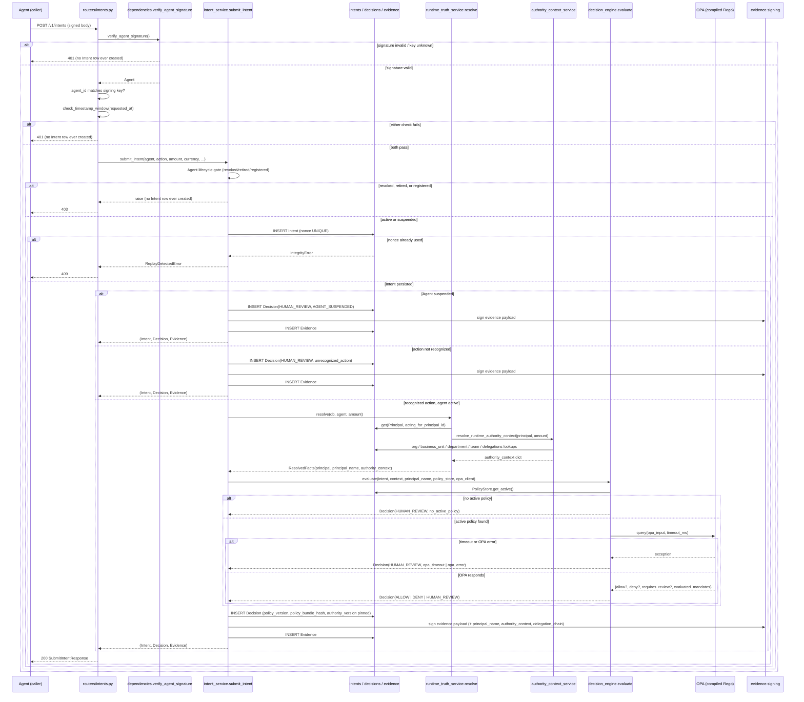
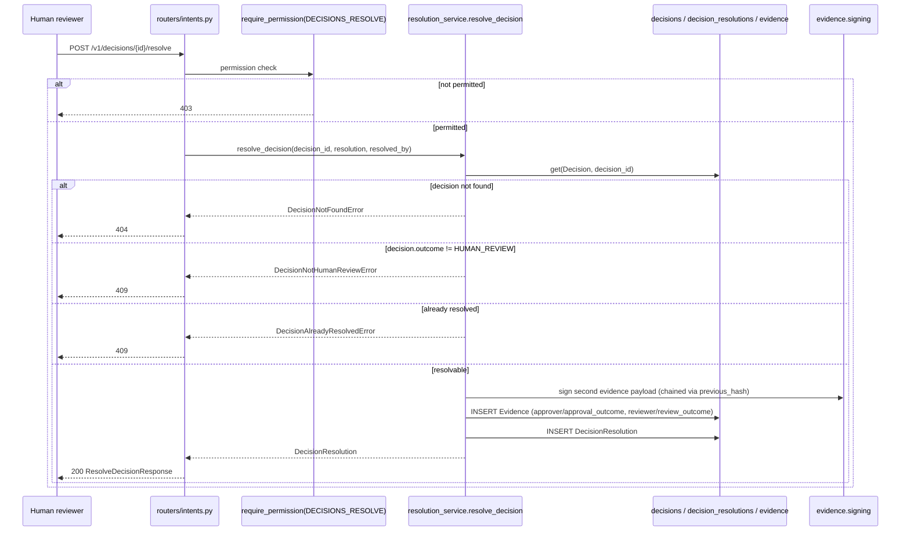

# Part 38 — Phase 4: Pipeline Sequence Diagram

**Status:** final. **Baseline:** [23](23_RUNTIME_GOVERNANCE_MIGRATION_BASELINE.md). **Stage definitions:** [37_PHASE_4_ENTERPRISE_DECISION_PIPELINE_SPEC.md](37_PHASE_4_ENTERPRISE_DECISION_PIPELINE_SPEC.md). Drawn directly from `dependencies.py`, `routers/intents.py`, `services/intent_service.py`, `services/runtime_truth_service.py`, `domain/decision/engine.py`, and `services/resolution_service.py` — the runtime as implemented today, not as originally imagined by any pre-existing design document.

## The submission path (Stages 0–9)

## The human-review resolution path (Stage 10 — a separate, later request)

## Reading this diagram against [37](37_PHASE_4_ENTERPRISE_DECISION_PIPELINE_SPEC.md)

Every `alt`/`else` branch above corresponds to exactly one row of [12_DECISION_ENGINE.md](12_DECISION_ENGINE.md) §12.5's fail-closed outcome table or one of [37](37_PHASE_4_ENTERPRISE_DECISION_PIPELINE_SPEC.md)'s ten stages — nothing in this diagram is inferred; each arrow names the actual function call or database statement it represents. The two diagrams together (this one, sequence; [37](37_PHASE_4_ENTERPRISE_DECISION_PIPELINE_SPEC.md), stage detail) are meant to be read side by side: this file answers "in what order, and under what condition," the stage table answers "with what inputs, outputs, and failure semantics."
