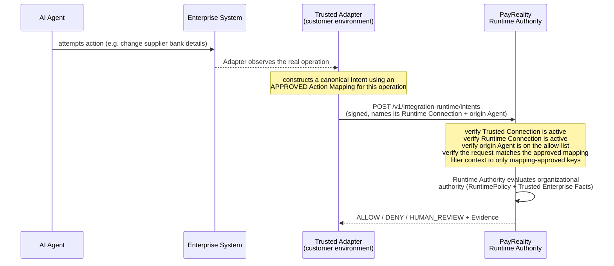
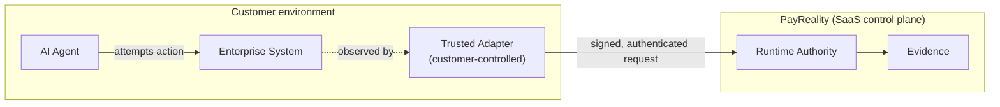

# Part 50 — Trusted Integration Architecture

**Supersedes/synthesizes:** `TRUSTED_INTEGRATION_PHASE1_KERNEL.md`, `TRUSTED_INTEGRATION_PHASE2_KERNEL.md`, `TRUSTED_INTEGRATION_PHASE3_OPERATION_IDENTITY.md` (kept in place as design-time records, not deleted or rewritten). This part is the current, verified, end-to-end account of what those three phases actually shipped, read directly from `server/app/services/integration_runtime_service.py`, `integration_contract_service.py`, `integration_identity_service.py`, `enforcement_binding_service.py`, `operation_identity_service.py`, the four Alembic migrations that back them (`c0eb613b4169`, `cdc87c8bea0d`, `741abf7b0146`, `a1f3e9c72b6d`), and the Settings → Integrations frontend (`src/app/integrations/`).

**A numbering note, because this repository already overloads the word "Phase" three separate ways**: "Trusted Integration Architecture, Phase 1–4" (this part's subject, referenced in code comments and commit messages) is a different numbering scheme from this specification's own "Phase 1–5" (the Runtime Governance Architecture migration tracked in parts 24–49), which is in turn different again from the *next*, not-yet-started milestone informally called "Phase 5" for Capability/enforcement work (see §50.9). None of the three share a timeline. This document is about Trusted Integration's own Phase 1–4 only, all four of which are complete and live.

## 50.1 What problem this solves

Before this architecture existed, PayReality had exactly one way to learn what an AI agent was attempting: the agent's own signed, self-authored description of itself (see [12_DECISION_ENGINE.md](12_DECISION_ENGINE.md)). That is a real, working, cryptographically authenticated statement of *who* is asking — but it is also, unavoidably, self-reported. Trusted Integration adds a second, independent path where a **customer-controlled component** — not the agent itself — attests what operation is actually being attempted against a real enterprise system, using a meaning the organization pre-approved. It is additive: the original agent-direct path (§50.6) is completely unchanged and remains fully supported.

## 50.2 The critical trust claim — three distinct questions, never conflated

Every description of this architecture, anywhere (docs, UI copy, sales material), must keep these three questions separate:

| Actor | Question it answers |
|---|---|
| **Agent** | *Who is acting?* — the autonomous workload whose delegated authority is being evaluated. |
| **Trusted Adapter** | *What company-controlled component is attesting what action is being attempted?* — an authenticated, non-agent identity that observed or constructed the request. |
| **PayReality** | *Does the organization authorize that Agent to perform that action under these conditions?* — the one question PayReality itself ever answers. |

Three claims that must **never** appear in any documentation, UI copy, or sales material, because none of them is true:

- The Adapter does **not** give the Agent authority. Authority still comes entirely from Runtime Policy, exactly as it does on the agent-direct path.
- PayReality does **not** trust the Agent "because an Adapter exists." The Adapter's attestation is evaluated on its own terms (identity, binding, allow-list — §50.4); it never substitutes for or upgrades the Agent's own standing.
- The Adapter does **not** objectively prove reality. `integration_runtime_service.py`'s own module docstring states this precisely: *"an authenticated IntegrationIdentity attests that it observed the external operation and constructed the canonical Intent using an approved Integration Contract. This does not mathematically prove the Adapter's own code is bug-free, that it sits on every possible execution path, or that the external operation ever executed. PayReality remains a PDP."*

## 50.3 Vocabulary — customer-facing term first, backend term second

| Customer-facing term | Backend model/table | What it is |
|---|---|---|
| **System** | `Integration` | One external enterprise system a customer has connected (e.g. "SAP S/4HANA"). |
| **Action Mapping** | `IntegrationContractVersion` | A deterministic, versioned, human-approved statement of what one external operation means in PayReality's vocabulary. |
| **Trusted Connection** | `IntegrationIdentity` + `IntegrationIdentityCertificate` | The authenticated, non-Agent identity a customer's Adapter presents; has its own Ed25519 certificate lifecycle. |
| **Runtime Connection** | `EnforcementBinding` + `EnforcementBindingAgent` | The live combination of one Trusted Connection + one approved Action Mapping + one environment + an explicit allow-list of Agents — the point where a mapping becomes eligible for real Adapter use. |
| **Environment** | `EnforcementBinding.environment` | A free-text scope (`production`, `staging`, …) a Runtime Connection is activated into; copied onto every Intent it produces, never caller-chosen. |
| **External Operation ID** | `Intent.external_operation_id` | The enterprise system's own stable identifier for one real business operation, used for idempotency (§50.7). |

Do not use the backend column/table names (`IntegrationContractVersion`, `IntegrationIdentity`, `EnforcementBinding`) in customer-facing documentation, the Admin UI, or sales material — they belong only in this part, [05_DATABASE.md](05_DATABASE.md), and [06_APIS.md](06_APIS.md).

## 50.4 The current live (Adapter-mediated) flow



Precisely, in the order `submit_attested_intent` (`integration_runtime_service.py:155-331`) actually checks it:

1. **Trusted Connection active.** The `IntegrationIdentity` presenting the request must be `active` (not suspended, revoked, or retired).
2. **Runtime Connection active.** The named `EnforcementBinding` must exist, belong to this Trusted Connection, and be `active` (not draft, not retired). A binding that exists but belongs to a *different* Trusted Connection looks exactly like "not found," never revealing that it exists.
3. **Origin Agent eligible and allow-listed.** The Agent the Adapter names as the one it's reporting on behalf of must exist, belong to this organization, be `active`, **and** appear on this specific Runtime Connection's explicit allow-list. There is no "all current and future agents" option anywhere in this system — the allow-list is enumerated, one Agent at a time, at Runtime Connection activation.
4. **The mapping actually matches.** `source_operation` and `canonical_action` in the request must match the approved Action Mapping's own values exactly — a mismatch is a hard rejection, never a fuzzy fallback and never `HUMAN_REVIEW`.
5. **Structural fields match what the mapping declares extractable.** If the mapping's Action Mapping declares a `resource_path`, the request must supply a resource; if it doesn't, the request must not (§50.5 explains why this can only be structural, not a proof of correspondence to the real source payload).
6. **Trusted context filtering (§50.5).**
7. **Environment is server-resolved, never caller-supplied.** `environment` is copied from the Runtime Connection's own activated environment; a caller that tries to supply its own `environment` key is rejected outright (`reserved_context_key_supplied`).
8. **Operation idempotency (§50.7).**

Only after every one of these passes does the request reach the *same* `intent_service._evaluate_and_record` core the agent-direct path uses — there is no second decision engine, no duplicated evaluation logic, anywhere in this codebase. From this point on, evaluation, ALLOW/DENY/HUMAN_REVIEW, and Evidence work identically to §50.6, with one deliberate difference: **Capability Authorization is currently suppressed for this path** (§50.9) — do not show a Capability step as live here.

## 50.5 Trusted context: what's allowed to influence a decision

Only information the Action Mapping explicitly declared, via its own approved `context_bindings`, may reach Runtime Authority. This is a mandatory, code-enforced rule, not a convention:

- Any context key the Adapter supplies that the approved mapping did **not** bind is rejected (`unexpected_context_keys`).
- Any key the mapping declared but the Adapter didn't supply is rejected (`missing_required_context_keys`).
- `environment` is reserved server-side (§50.4, step 7) — a caller can never smuggle its own value in under that name.

This is the guard against an Agent (or a compromised/buggy Adapter) smuggling an arbitrary value into policy evaluation as if it had been pre-approved. Nothing outside the mapping's declared bindings is ever "trusted context" — everything else is, at most, non-authoritative metadata that never reaches a RuntimePolicy condition.

**A precise limit, stated honestly**: PayReality cannot independently reconstruct the original external system's payload, so it cannot cryptographically prove an extracted value corresponds to the real source. What it *can* and does enforce is **structural consistency** between what the Action Mapping declares extractable and what the Adapter actually attested (`_check_structural_field`, `integration_runtime_service.py:86-95`) — a genuinely different, weaker guarantee than "PayReality verified the real external system's data," and documentation must never blur the two.

## 50.6 The agent-direct flow (lower semantic assurance) — unchanged, fully supported

The original, and still fully supported, path: an authenticated Agent submits a signed Intent directly (`POST /v1/intents`), describing the action itself. PayReality can strongly prove *who submitted the request* (the Agent's Ed25519 signature) and *what authority decision was made* (the signed Decision/Evidence). It does **not** independently establish that the Agent's own description of the action matches whatever the Agent then actually attempts against a real external system — there is no second, independent observer in this path.

This is not a defect and not "broken" — it is a real, useful, lower-semantic-assurance mode, appropriate wherever a customer doesn't need or hasn't yet built Adapter-mediated attestation for a given integration. Both paths produce the same three outcomes, the same Evidence structure, and the same fail-closed guarantees; they differ only in whether a second, customer-controlled party corroborates what the Agent describes.

## 50.7 Operation idempotency (Trusted Integration, Phase 3)

One real business operation produces exactly one authority decision, even if the enterprise system retries the network call that reported it.

Mechanism (`operation_identity_service.py`, wired into `submit_attested_intent`): every attested Intent carries the Adapter-supplied `external_operation_id`, scoped to `(integration_id, environment)`. A `canonical_operation_fingerprint` is computed over every authority-relevant field (origin agent, contract content hash, source operation, canonical action, resource, amount, currency, fact subject, trusted context) — deliberately *not* over anything non-authority-relevant, so cosmetic differences between two reports of the same real operation don't manufacture a false conflict.

| Scenario | Result |
|---|---|
| Same operation, network retry (identical fingerprint) | The **existing** Decision is returned. No new evaluation, no new Decision row, no new Evidence. |
| Same `external_operation_id`, different amount | **Conflict** (`ExternalOperationConflictError`) — never silently evaluated, never a new Decision. |
| Same `external_operation_id`, different Agent | **Conflict**, same mechanism. |
| Same operation, submitted again after the governing policy changed | The **original** Decision is returned — a retry re-resolves nothing; it is not re-evaluated against whatever policy happens to be active now. |

A partial-unique DB index (`idx_intents_external_operation_scope`, unique on `integration_id, environment, external_operation_id` where non-null) makes this a real, race-safe invariant, not a best-effort check — a concurrent duplicate submission is resolved by re-querying after the losing insert's `IntegrityError`, not by a lost update.

**Do not confuse this with nonce replay protection.** `(integration_identity_id, nonce)` uniqueness (`AdapterReplayDetectedError`) is authentication-level replay defense — "do not accept the same authenticated request object again" — entirely separate from, and checked independently of, business-operation idempotency, which is about the real-world operation the request *describes*, not the request message itself.

## 50.8 The failure model: integration rejection vs. DENY

These are two categorically different outcomes and documentation must never blur them:

- **Integration rejection** (`IntegrationRejectionError`, `AdapterReplayDetectedError`, `ExternalOperationConflictError`) means **PayReality could not establish a trustworthy request to evaluate at all.** Examples: invalid Trusted Connection, inactive Runtime Connection, an Agent not on the allow-list, a mapping mismatch, invalid trusted context, an operation-ID conflict. None of these ever produce a Decision row or an Evidence record — there is nothing to sign, because nothing was evaluated.
- **DENY** means **PayReality successfully evaluated a legitimate, trustworthy authority request and determined the organization does not authorize it.** A DENY always has a Decision and signed Evidence behind it.

An integration rejection is closer in kind to "this request never reached the front door" than to "the front door said no."

## 50.9 Capability Authorization: deliberately suppressed for this path

`capability_service.issue_capability_for_decision` raises `CapabilityNotAvailableForIntegrationIntentError` (HTTP 409, `capability_not_available_for_integration_intent`) whenever the originating Intent's `integration_identity_id` is non-null — i.e., for every Adapter-mediated decision, unconditionally, whether it resolved ALLOW immediately or reached ALLOW later via a `HUMAN_REVIEW` resolution.

This is not an oversight and not unfinished security — it is a named, deliberate scope boundary, in the code's own words: *"Issuing a Capability for an Adapter-mediated Intent would hand out an unbound downstream execution permission on top of a trust chain (Adapter attestation + Binding authorization) that Phase 2 never designed to carry that weight — doing it safely is Phase 5's enforcement-mode work."* ("Phase 5" there means Trusted Integration's own future phase, not this specification's Phase 1–5 — see the numbering note at the top of this document.)

Concretely, this means: for an Adapter-mediated decision, there is currently no capability token to issue, present, or verify, at all. A future enforcement phase would need to design how a Capability binds not just an Agent's own authority but the trust chain a Trusted Connection and Runtime Connection actually carry — that design does not exist yet, and this document makes no claim about what it will look like.

**Never state or imply**: that a consumed Capability means the downstream action completed (true for either path — see [POC_READINESS_REPORT.md](../POC_READINESS_REPORT.md) §5) — and never, for the Adapter path specifically, that a Capability was issued at all.

## 50.10 PayReality remains a PDP on this path too

Every guarantee in §50.2–§50.9 above is about what PayReality is willing to **accept as trustworthy input** to its own evaluation — never about reaching out to, enforcing against, or observing any external system itself. `enforcement_binding_service.py`'s own module docstring: *"Despite the name, none of this makes PayReality a PEP. Every function below only ever governs what PayReality's own Runtime Authority evaluation is willing to accept as trusted input — it never reaches out to, enforces against, or observes any external system."* See [01_PRODUCT_OVERVIEW.md](01_PRODUCT_OVERVIEW.md) §1.2 and [POC_READINESS_REPORT.md](../POC_READINESS_REPORT.md) §8 for the PDP/PEP boundary in full.

## 50.11 Deployment model — where the Trusted Adapter runs



The default, and only currently-shipped, deployment model is a Trusted Adapter running **inside the customer's own environment** — it is a component the customer controls, deploys, and is responsible for, exactly like an Agent's own key material. PayReality does not host, run, or have any standing access to a customer's enterprise systems; it only ever receives what an already-authenticated Trusted Connection chooses to send it. "PayReality secretly watches enterprise systems" is not an accurate description of this architecture under any circumstance and must never appear in documentation or marketing.

PayReality's own control plane (Runtime Authority evaluation, Evidence, the Admin UI) runs as a multi-tenant SaaS service, unchanged by Trusted Integration. This document does not claim a packaged self-hosted or dedicated-instance SKU exists — see [16_CURRENT_LIMITATIONS.md](16_CURRENT_LIMITATIONS.md) §16.7.

## 50.12 Action Mapping lifecycle

`draft → validated → approved → retired`, one immutable row per version (`integration_contract_service.py`):

- **draft**: created, freely editable.
- **validated**: semantic fields re-checked (recognized canonical action, well-formed paths/context bindings), `content_hash` computed and frozen. From here the mapping is immutable.
- **approved**: a human with governance authority (`approver`) accepted this exact, already-frozen mapping. Approval never deploys anything, never touches OPA, never touches a RuntimePolicy, never touches an Agent — it only records that the mapping was reviewed and accepted.
- **retired**: explicit only, never automatic, never triggered by a newer version's approval. The historical row is never deleted.

**Multiple `approved` versions of the same `(integration_id, source_operation)` may legitimately coexist** — e.g. production still pinned to v1 while staging trials v2. There is deliberately no single "current version" concept at the mapping level; selecting exactly one approved version to actually use is entirely the Runtime Connection's job (§50.13). Documentation and UI must never imply a mapping has one active version the way a RuntimePolicy has one active deployment.

## 50.13 Runtime Connection lifecycle

`draft → active → retired` (`enforcement_binding_service.py`):

- **draft**: only organization-ownership of the named Trusted Connection, Action Mapping, and any named Agents is checked. A Runtime Connection can be sketched out while its mapping is still mid-review.
- **active**: full activation prerequisites are enforced — Trusted Connection must be `active`, Action Mapping must be `approved`, the allow-list must be non-empty, and every allow-listed Agent must itself be `active`. Activating atomically retires whichever other Runtime Connection previously held the single active slot for this exact `(Trusted Connection, System, source operation, environment)` scope — a real, DB-enforced invariant (`idx_enforcement_bindings_single_active_per_scope`), not a convention.
- **retired**: explicit only. A retired Runtime Connection's historical Intents remain fully queryable forever; retiring one never touches anything it already produced.

An **approved Action Mapping still referenced by an active Runtime Connection cannot be retired** (`has_active_binding_for_contract_version`) — the dependency runs one direction only.

## 50.14 Evidence and Authorization Receipt lineage for an Adapter-mediated decision

Trusted Integration adds no second signing mechanism and no second Evidence path. An Adapter-mediated decision produces Evidence exactly the way an agent-direct one does ([13_EVIDENCE_ENGINE.md](13_EVIDENCE_ENGINE.md)) — the only difference is what's in the payload:

```
organizational authority (RuntimePolicy)
  → Agent (the origin agent the Runtime Connection allow-listed)
  → trusted integration provenance (Trusted Connection, Runtime Connection, Action Mapping version,
     content hash, System, environment, source operation, external operation ID)
  → policy version
  → Trusted Enterprise Facts relied upon, if any
  → Decision (ALLOW / DENY / HUMAN_REVIEW)
  → Evidence (Ed25519-signed, hash-chained, identical mechanism to the agent-direct path)
```

`GetDecisionResponse.integration` and `AuthorizationReceiptResponse.integration` (`schemas/intent.py`, `ReceiptIntegrationSummary`) carry exactly this provenance — `integration_identity_id`, `enforcement_binding_id`, `integration_contract_version_id`, `integration_contract_content_hash`, `integration_id`, `environment`, `source_operation`, `external_operation_id` — and are `null` for an agent-direct decision. This is how Decision Detail, the Authorization Receipt, and Agent Detail's own "Trusted connections" section each independently answer "was this Adapter-mediated, and if so, through what."

**Historical provenance stays pinned.** `environment`, `integration_identity_id`, `enforcement_binding_id`, and `external_operation_id` all live on the `Intent` row at submission time and are never rewritten — not when a `HUMAN_REVIEW` decision is later resolved (§12_DECISION_ENGINE.md's resolution flow never touches the `Intent` row at all; see [50.15](#5015-human-review-for-an-adapter-mediated-decision) below), not when the Action Mapping or Runtime Connection is later retired, not ever. A Receipt generated a year after a Runtime Connection was retired still shows exactly the mapping version, environment, and connection that were live at the moment the decision was made.

**The Authorization Receipt is a real, shipped, named artifact** (`GET /v1/decisions/{id}/receipt`, `authorization_receipt_service.py`) — a packaged, human-readable presentation of one Decision's existing Evidence, Authority, Facts, and (where applicable) integration provenance and verification status. It is not a second cryptographic artifact and not a stronger proof than Evidence itself: it never claims the downstream external operation executed, whichever path produced the Decision it describes.

## 50.15 Human Review for an Adapter-mediated decision

Identical mechanism to the agent-direct path ([12_DECISION_ENGINE.md](12_DECISION_ENGINE.md), [13_EVIDENCE_ENGINE.md](13_EVIDENCE_ENGINE.md) §13.6): the original Decision's `outcome` stays `HUMAN_REVIEW` forever; a human's later `approved`/`denied` answer is stored as a separate `DecisionResolution` row, appending a second Evidence record rather than editing the first. `resolution_service.resolve_decision` never reads or writes any of the Intent's integration-provenance fields, so an Adapter-mediated decision's Trusted Connection/Runtime Connection/mapping/environment/external-operation-ID all remain exactly what they were at submission, regardless of when or how the review is resolved. There is no push/callback/webhook: a caller (the SDK's `wait_for_resolution`, or a custom poller) must check back — see [11_AGENT_ARCHITECTURE.md](11_AGENT_ARCHITECTURE.md) for the SDK mechanism, identical for both paths.
